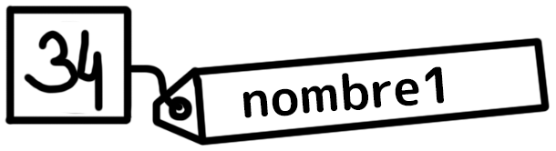
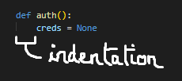
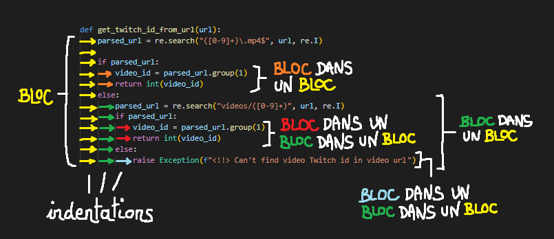
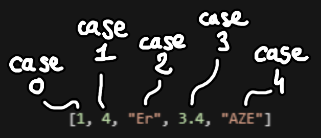
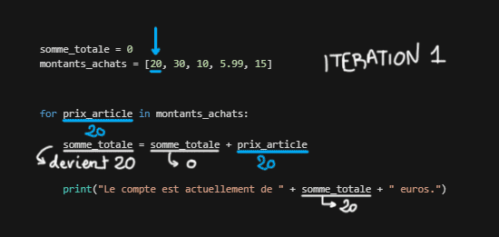

---
jupytext:
  formats: md:myst
  text_representation:
    extension: .md
    format_name: myst
    format_version: 0.13
    jupytext_version: 1.11.5
kernelspec:
  display_name: Python 3
  language: python
  name: python3
---

# Cours Python

## Variable
Une case mémoire portant un nom et dans laquel peut stocker une [valeur](#valeur).



Une variable a plusieurs utilités :

* On peut s'en servir pour y stocker une [valeur](#valeur), faire des [opérations](#operateurs) dessus, les restocker dans d'autres variables, etc
    ```python
    nombre1 = 34
    nombre2 = 45
    nombre3 = 488 - nombre1
    resultat = nombre1 + nombre2 * nombre3
    ```

* On peut y stocker une valeur particulière à un seul endroit pour la rappeler à plusieurs autres endroits dans son code, simplement en utilisant le nom de la variable, et sans avoir besoin de copier/coller la valeur à chaque occurence. (❗FACT: une variable destinée à cet usage particulier est souvent appelée **constante**)
  
  En plus d'être plutôt pratique, cela évite bien des erreurs lors de l'écriture du code, permettant d'éviter d'oublier de changer la valeur aux différents endroits où on l'emploie, si jamais on a besoin de la changer pour une raison ou une autre.
```python
prenom = "Sophia"

texte_bienvenue = "Bonjour " + prenom + " ! Comment vas-tu aujourd-hui, " + prenom + " ? Est-ce que je peux t'appeler " + prenom + ", " + prenom + " ?"

print(texte_bienvenue)
```

* On peut récupérer les valeurs retournées par des fonctions, pour les utiliser en entrée pour d'autres fonctions, faire des opérations dessus, etc, etc
```python
temperature_celsius = obtenir_temperature_paris()
temperature_fahrenheit = (temperature_celsius * 9 / 5) + 32
```

---

## Valeur
Une valeur est une information, qui peut être contenue dans une [variable](#variable) et qui peut être utilisée dans une opération impliquant d'autres valeurs permettant d'obtenir un résultat.

Il peut s'agir de n'importe quelle information manipulable en langage Python :

* un nombre
    `420`

* un nombre à virgule (ou ça fait une petite différence mais en vrai ça va)
    `65.458`

* une [chaîne de caractère](#chaîne-de-caractères) *(= un texte)*
    `"Je suis un texte"`

* un booléen (`True` ou `False` = **vrai** ou **faux**)
    `True`

* une [liste](#listes)
    `[45, "une case", 68, "autre case"]`

* un [dictionnaire](#dictionnaires)
    `{"prenom": "charles", "nom": "ingalls", "phone": "0612131213"}`

* ...

---

## Assignation
L'opération d'assignation consiste à stocker une [valeur](#valeur) dans une [variable](#variable).

L'[opérateur](#operateurs) utilisé est `=` (à ne pas confondre avec l'opérateur `==` permettant de tester l'égalité entre 2 variables !)

La syntaxe est la suivante : le nom de la variable qui va recevoir la valeur (ou le résultat de l'opération) est toujours à écrire **en premier**, puis on écrit l'opérateur `=`, puis la valeur à stocker.

```python
nom_variable = 34
```

---

## Indentation
Une ligne de code indentée est une ligne de code décalée sur la droite, par une espaces ou une tabulation (de préférence 4 espaces)

En Python, l'indentation d'une série de ligne de code indique qu'elle appartiennent à un même [bloc de code](#bloc-de-code).



---

## Bloc de code
Un bloc de code est une série de lignes de code [indentés](#indentation), et dont la ligne précédente finit la plupart du temps (pour ne pas dire toujours) par deux points `:`

Il peut s'agir du code contenu dans une [fonction](#fonction), ou bien du code qui s'exécutera suite à la vérification d'une [condition](#condition), ou le code qui s'exécutera à répétition dans le cas lorsqu'il est défini dans le cadre d'une [boucle](#boucles), etc...

Les blocs peuvent être imbriqués les uns dans les autres.



**NB**: Il s'agit de l'équivalent en C++/C# du code que l'on peut trouver entre `{ }`

---

## Commentaires
Du texte contenu dans le code, totalement ignoré par l'interpréteur/compilateur.

Commence par un dièse (`#`) et peut contenir absolument n'importe quoi.

Ils servent à expliquer ce qu'on fait à quiconque relit ton code, ou à soi-même pour s'y retrouver. Plus rarement (ou pas?) à raconter des blagues ou passer faire des remarques salées sur la qualité du travail des collègues.

### Exemple
```python
# Je crée cette variable
cette_variable = 65

# J'ajoute 4 à cette variable
cette_variable = cette_variable + 4  # (j'ai choisi 4 car c'est un joli chiffre)

# J'affiche cette variable
print(cette_variable)
```

---

## Expression
Une expression est une formule combinant valeurs et/ou variables et [opérateurs](#operateurs). Elles servent par exemple à transformer des informations d'une forme à une autre, combiner plusieurs informations ensemble pour obtenir un résultat, ou bien formuler un test qui permettra de définir si une [condition](#condition) exécutera son [bloc de code](#bloc-de-code) ou non.

### Exemple 1
```python
username == "f.clement"
```

Cette expression vérifie si le contenu de la variable `username` en cours contient la valeur `f.clement`.

Peut-être utilisé pour vérifier l'identité de l'utilisateur·ice Windows en cours, par exemple :
```python
import os

username = os.getlogin()

if username == "f.clement":
    print("Bonjour, Freddy !")
else:
    print("Bonjour !")
```

(on aurait pu bien entendu écrire directement `if os.getlogin() == "f.clement":`, comme vous vous en doutez possiblement)

### Exemple 2
```python
import datetime

heure_de_maintenant = datetime.datetime.now()

if heure_de_maintenant.hour >= 17 and heure_de_maintenant.minute >= 30:
    print("C'est plus l'heure")
else:
    print("C'est pas l'heure")
```

Cet exemple va récupérer l'heure en cours, puis, au moyen d'une expression, va vérifier si le nombre d'heures en cours est supérieur ou égal à 17 et si le nombre de minutes est plus grand que 30.

Cette expression sera donc vraie si les 2 conditions sont réunies, et l'affichage sera différent si l'heure 17h30 est dépassée ou non.

---

## Opérateurs
Ce sont des symboles permettant de combiner des [valeurs](#valeur) entre elles, suivant des opérations qui leur sont propres.

### Opérations
* `+` : va **additionner** 2 valeurs **SI** ces 2 valeurs sont de type **numérique** (des entiers `int` ou des nombres à virgules `float`)
  ```python
  num = 3
  resultat = 410 + num + 7
  ```
  Après exécution de cet exemple, la variable `resultat` contiendra le nombre `420`.

* `+` : va **concaténer** (c'est-à-dire coller) 2 valeurs **SI** ces 2 valeurs sont de type **chaîne de caractères** (c'est-à-dire du **texte**/des `string`)
  ```python
  prenom = "Freddy"
  texte_bievenue = "Bonjour, " + prenom + " !"
  print(texte_bienvenue)
  ```
  L'exemple ci-dessus affichera `Bonjour, Freddy !`.

* `-` : va **soustraire** 2 valeurs
  ```python
  resultat = 80 - 25.5
  ```
  Ça fait que `resultat` contiendra `54.5` oui

* `*` : va **multiplier** 2 valeurs
  ```python
  caca = 2 + 2
  le_resultat = caca * 11
  ```
  `le_resultat` ça sera `44`

* `/` : va **diviser** 2 valeurs
  ```python
  taille_semaine = 365 / 7
  ```
  `taille_semaine` contiendra le nombre de jours par semaine à savoir précisément `52,142857142857142857142857142857`

* `=` : va [**assigner**](#assignation) une valeur (ou le résultat d'une opération/expression) à une variable
  ```python
  macron = "demission"
  ```
  La variable `macron` contient à présent la valeur de type [chaîne de caractère](#chaîne-de-caractères) `demission` (tout naturellement)

❗**NOTE** : on peut utiliser les opérateurs `+= -= *= /=` afin d'effectuer une des opérations `+ - * /` entre la valeur contenue dans une variable et une seconde valeur, stockant le résultat de l'opération dans cette même variable.

Par exemple, plutôt qu'écrire :
```python
a = 24
a = a + 10  # on additionne 10 à la valeur déjà contenue dans a et on stocke le résultat dans a
```

on peut écrire :
```python
a = 24
a += 10     # on additionne 10 à la valeur déjà contenue dans a et on stocke le résultat dans a
```

Dans les 2 cas, `a` vaudra au final `34`.

### Tests
Ces opérateurs testent : 
* `==` : Si deux valeurs sont égales/identiques
* `!=` : Si deux valeurs sont différentes
* `>` : Si la valeur à gauche de l'opérateur est supérieure à la valeur de droite
* `<` : Si la valeur à gauche de l'opérateur est inférieure à la valeur de droite
* `>=` : Si la valeur à gauche de l'opérateur est supérieure **OU ÉGALE** à la valeur de droite
* `<=` : Si la valeur à gauche de l'opérateur est inférieure **OU ÉGALE** à la valeur de droite

**Note** : Les opérateurs `< > <= >=` ne sont utilisables qu'entre valeurs numériques.

##### Exemples
Toutes les expressions suivantes sont vraies :
```python
3 == 3
```

```python
len("Bonjourent") != 39
```

```python
[78, 54, 21, 65, 10][3] == 65
```

```python
9 * 9 > 65
```

```python
1 / 8 < 1 * 8
```

```python
984984 * 0 >= 0
```

```python
-69 <= 0
```

### Opérateurs booléens
Les trucs genre `AND` *(= et)* et `OR` *(= ou)*.
* `AND` c'est pour tester si plusieurs expressions sont toutes vraies
* `OR` c'est pour tester si au moins l'une d'entre elles est vraie

*(à continuer d'écrire parce que dsl j'ai la flemme là)*

---

## Chaîne de caractères
Une chaine de caractère est un type de [variable](#variable) représentant basiquement un texte, à savoir techniquement un enchaînement de caractères alphanumériques, de caractères spéciaux, etc.

D'où son nom.

### La concaténation
Il s'agit de combiner plusieurs chaînes de caractères en une seule. Tel une addition arithmétique, on utilise pour cette opération l'opérateur `+`.

#### Exemple
```python
prenom = "Freddy"
phrase_bienvenue = "Bonjour, " + prenom + " ! Comment vas-tu?"
```

La variable `phrase_bienvenue` contiendra `Bonjour, Freddy ! Comment vas-tu?`

:::{admonition} Concaténer du texte avec des nombres
:class: warning

Attention cependant, si vous essayez de combiner chaînes de caractères avec des nombres, par exemple avec ce genre de code :

```python
mon_age = 30
phrase_avec_mon_age = "J'ai " + mon_age + " ans"
```

Python vous enverra bouler avec l'une des erreurs suivantes :
```
TypeError: can only concatenate str (not "int") to str
```
ou
```
TypeError: unsupported operand type(s) for +: 'int' and 'str'
```

Il est en effet impossible de concaténer tel quel un nombre avec une chaîne de caractère, car ce sont des **types de données différents**.

Il faudra auparavant convertir vos variables nombre en chaînes de caractère afin de n'avoir plus QUE des chaînes de caractères à concaténer.

```python
mon_age = 30
phrase_avec_mon_age = "J'ai " + str(mon_age) + " ans"
```

Vous pourrez trouver quelques infos supplémentaires à la partie portant sur le [casting/les conversions](#casting).
:::


### Accéder à un caractère en particulier
Ce type de données partage quelques particularités avec les [listes](#listes), en particularité la particularité de pouvoir accéder à chacun de ces caractères indépendamment en utilisant la même syntaxe que l'on utilise pour accéder à la case d'une liste : en inscrivant le nom de la variable (ou directement la valeur), immédiatement suivie mettant le numéro du caractère entre crochets [ ].

##### Exemple
```python
un_texte = "Ceci est un texte fantastique"
la_premiere_lettre = un_texte[0]
la_lettre_qui_est_s = un_texte[6]
```

La variable `la_premiere_lettre` contiendra `C`, tandis que la variable `la_lettre_qui_est_s` contiendra la valeur `s`.

---

## Listes
C'est un type de [valeur](#valeur), qui permet de stocker une série de valeurs dans la même [variable](#variable), et qu'on peut appeler également, en Python, **tableaux** ou **arrays**.

Les listes peuvent avoir autant de cases que la mémoire de l'ordinateur peut en contenir.

On peut les voir comme des tableaux Excel à une seule ligne (ou une seule colonne suivant comment vous voyez les choses).

Pour créer un tableau, on écrit le contenu de ses différentes cases entre crochets `[]`, les valeurs de chaque cases étant séparées les unes des autres en utilisant une virgule `,`

On peut par exemple déclarer cette liste, comportant 5 cases comprenant des valeurs différentes :
```python
ma_liste_trop_stylee = [1, 4, "Chevale", 3.4, "Ah bon"]
```

:::{admonition} NOTE
:class: note
En Python et contrairement à de nombreux autres langages (ceux que l'on dit "typés" notamment) : chaque case peut avoir un type différent.
:::

### Accéder à une case de la liste

Chaque case d'une liste est comme une variable à laquelle on peut accéder en ajoutant son numéro de case entre crochets `[]` juste après le nom de la variable désignant la liste : par exemple pour manipuler la case n°`3` de `ma_liste`, on écrit `ma_liste[3]`

:::{admonition} IMPORTANT 🚨
:class: warning
La numérotation des cases commence par `0` et non par `1`. La dernière case d'une liste à 10 entrées (par exemple) sera donc numérotée `9`.
:::



### Les méthodes d'une liste
Les listes étant basiquement des [objets](#objet) de classe `list`, on peut les manipuler grâce à leurs nombreuses [méthodes](#les-méthodes) :

* `.append` permet d'ajouter une case à la fin de la liste.
```python
ma_super_liste = [34, "oui"]
ma_super_liste.append(420)
```
`ma_super_liste` contiendra donc à présent la valeur `[34, "oui", 420]`

* `.remove` permet de supprimer une case à une liste.
```python
liste_demission = ["Macron", "Pecresse", "Edwy", "L'abjecte", "Valls"]
liste_demission.remove("Edwy")
```
`liste_demission` contiendra donc à présent la valeur `["Macron", "Pecresse", "L'abjecte", "Valls"]`

* `.clear` permet de vider une liste.
```python
animaux_nuls = ["chats", "chiens", "ours", "lapins", "cochons"]
animaux_nuls.clear()
```
`animaux_nuls` contiendra donc à présent la valeur `[]` (c'est-à-dire une liste vide, car tous les animaux méritent oui)

* `.extend` permet d'ajouter le contenu d'une autre liste dans la liste dont on utilise la méthode.
```python
nombres_cools = [8, 6, 12, 420]
nombres_cools.extend([86, 98])
```
`nombres_cools` contiendra donc à présent la valeur `[8, 6, 12, 420, 86, 98]`

❗**NOTE:** on aurait utilisé `.append` à la place d'`.extend`, le résultat aurait été `[8, 6, 12, 420, [86, 98]]`.

`[86, 98]` est une valeur (de type `list`) et aurait donc été ajouté en **tant que valeur** dans une case à la fin de la liste.

* Le reste se trouve dans la [documentation](https://docs.python.org/fr/3/tutorial/datastructures.html).

---

## Condition
La condition sert à exécuter un [bloc de code](#bloc-de-code) particulier si et seulement si le test attaché à la condition est vrai.

On utilise pour cela le mot-clé `if` *(= si)*, suivi de la condition à tester sous forme d'[expression](#expression).

Le code qui sera exécuté si la condition est vraie sera le bloc de code faisant directement suite à cette première ligne.

Si besoin, on peut **facultativement** utiliser le mot-clé `else` *(= sinon)* pour définir un autre bloc de code qui sera exécuté si aucune condition n'est satisfaite, à savoir si tous les résultats de tous les tests se révèlent être faux.

##### Exemple de la syntaxe
```python
un_nombre = 18

if un_nombre > 10:
    print("Mon nombre est supérieur à 10 !")
else:
    print("Mon nombre est inférieur (ou égal) à 10 !")
```

Quelques exemples de conditions un peu (un peu) moins idiots sont trouvables dans la partie sur les [expressions](#expression).

---

## Boucles 
Une boucle permet d'exécuter un [bloc de code](#bloc-de-code) plusieurs fois.

Il en existe 2 différentes en Python : la boucle [for](#boucle-for) et la boucle [while](#boucle-while).

### Itération
C'est une unique exécution du bloc de code définit pour une boucle, exécutée entièrement avant de boucler de nouveau.

En d'autres mots, le début d'une nouvelle boucle occasionnera donc le début d'une nouvelle itération.

### Boucle for
La boucle `for` *(="pour...faire" en français)* exécute un bloc de code autant de fois qu'il y a d'entrées dans une [liste](#listes).

La syntaxe est la suivante :
```python
for variable_contenu_case in variable_liste:
    # Bloc de code indenté à faire boucler
```

`variable_contenu_case` est une [variable](#variable) qui, à chaque [itération](#itération) de la boucle, prendra pour [valeur](#valeur) le contenu de chaque case de la liste.

C'est-à-dire que le bloc de code sera exécuté autant de fois qu'il n'y a de cases dans la liste. Si ce bloc utilise la variable spécifiée entre le `for` et le `in` (ci-dessus appelée `variable_contenu_case`), alors ce bloc de code s'exécutera une fois pour chacune des valeurs contenues la liste.

Comme toujours, on peut mettre directement une [valeur](#valeur) à la place d'une [variable](#variable)

##### Exemple 1
```python
for prenom in ["Julien", "Myriam", "Raymond", "Laura", "Fatiha"]:
    message_accueil = "Bonjour, " + prenom + " !"
    print(message_accueil)
```

Affichera :
```
Bonjour, Julien !
Bonjour, Myriam !
Bonjour, Raymond !
Bonjour, Laura !
Bonjour, Fatiha !
```

Ecrire cet exemple ainsi, en utilisant une boucle for, revient exactement au même qu'écrire le code cette façon :
```python
prenom = "Julien"
message_accueil = "Bonjour, " + prenom + " !"
print(message_accueil)

prenom = "Myriam"
message_accueil = "Bonjour, " + prenom + " !"
print(message_accueil)

prenom = "Raymond"
message_accueil = "Bonjour, " + prenom + " !"
print(message_accueil)

prenom = "Laura"
message_accueil = "Bonjour, " + prenom + " !"
print(message_accueil)

prenom = "Fatiha"
message_accueil = "Bonjour, " + prenom + " !"
print(message_accueil)
```

Le résultat est parfaitement identique, MAIS cette manière d'écrire est évidemment bien plus longue, bien moins pratique et beaucoup plus sujette à erreurs si jamais on souhaitait ajouter, supprimer ou changer des prénoms, ou bien changer ce que l'on en fait. (si on veut faire autre chose que les afficher)

##### Exemple 2
```python
somme_totale = 0
montants_achats = [20, 30, 10, 5.99, 15]

for prix_article in montants_achats:
    somme_totale = somme_totale + prix_article
    print("Le compte est actuellement de " + somme_totale + " euros.")

print("La somme totale à payer est de " + somme_totale + " euros !")
```

Affichera :
```
Le compte est actuellement de 20 euros.
Le compte est actuellement de 50 euros.
Le compte est actuellement de 60 euros.
Le compte est actuellement de 65.99 euros.
Le compte est actuellement de 80.99 euros.
La somme totale à payer est de 80.99 euros !
```

On peut se représenter le déroulement de l'exécution de notre programme à l'aide de cette petite animation :


##### Exemple 3
Ce code, utilisant la fonction `telecharger_photo_chien` définie dans [l'exemple de la partie fonctions](#exemple-2), va télécharger 10 photos de chiens aléatoires récupérées depuis un service Internet.

Pour cela, nous utiliserons un petit service Web gratuit qui, lorsqu'il est questionné, renvoie une adresse Web aléatoire de photo de chien depuis sa base de données.

La fonction `telecharger_photo_chien` prend simplement un nom de fichier (sans extension) en paramètre d'entrée, et se chargera de questionner le service, télécharger la photo et l'écrire avec le nom de fichier indiqué en paramètre.

```python
for i in range(10):
    telecharger_photo_chien("image_de_chieng_" + str(i+1))
```

##### Exemple 4
Ce code sert à ouvrir une série d'onglets dans le navigateur Web par défaut de l'ordi, pointant chacun sur un Google Maps montrant la première commune correspondant aux code postaux définis dans la variable `liste_code_postaux`.

Elle réutilise la fonction `convertir_coordonnee` définie dans l'exemple de fonction que l'on a écrit [ici](#exemple-1).

Elle utilise également le module `requests` permettant de faciliter la communication et le téléchargement de pages Internet, de ressources multimédias disponibles sur le Web, communications avec des API (comme ici présent)... Voir le paragraphe [Modules](#modules--imports) pour plus d'infos à leur sujet.

Pour ce script, nous allons questionner le service web zippopotam.us, qui permet d'obtenir des informations sur les communes correspondant à un code postal particulier.

Aller sur l'URL `http://api.zippopotam.us/fr/[CODE POSTAL]` envoie une réponse, au format **JSON** (un format de données très facile à décoder via différents langages, s'apparentant à une donnée de type *dictionnaire*)

```python
import requests
import webbrowser

def convertir_coordonnee(valeur_coordonnee):
    partie_entiere = int(valeur_coordonnee)
    partie_decimale = valeur_coordonnee - partie_entiere
    secondes = int(partie_decimale * 60)
    return str(partie_entiere) + "°" + str(secondes) + "'00.0\""

liste_code_postaux = ["75020", "46800", "59100", "07700", "51130"]

for code_postal in liste_code_postaux:
    reponse_requete = requests.get("http://api.zippopotam.us/fr/" + code_postal)
    lieux = reponse_requete.json()["places"]

    premier_patelin = lieux[0]

    latitude_temps = convertir_coordonnee(float(premier_patelin["latitude"]))
    longitude_temps = convertir_coordonnee(float(premier_patelin["longitude"]))

    webbrowser.open("https://www.google.fr/maps/place/" + latitude_temps + "N+" + longitude_temps + "E")
```

### Boucle while
Une boucle `while` *(="tant que...faire" en français)* exécutera son [bloc de code](#bloc-de-code) autant de fois que la [condition](#condition) associée restera vraie.

```python
while <condition>:
    # Bloc de code indenté à faire boucler tant que la condition est vraie
```

Tout comme les conditions [if](#if), les conditions des boucles **while** sont écrites sous la forme d'une [expression](#expression) qui sera vérifiée avant chaque début d'[itération](#itération). Si la condition ne se vérifie pas et donc que le test échoue, alors la boucle s'arrête, le bloc de code ne sera pas exécuté, et on continuera notre exécution avec le code qui fait suite à la boucle **while**.

##### Exemple 1
```python
i = 0
while i < 10:
    print(i)
    i += 3
```

Cet exemple affichera
```
0
3
6
9
```

##### Exemple 2
```python
mots_communs = ["bonjour", "rigodon", "chat", "morceau", "pot-au-feu", "week-end"]
mots_liaison = ["le", "un", "du"]

phrase = ""

while len(phrase) < 100:
    phrase += random.choice(mots_liaison) + " " + random.choice(mots_communs) + " "
```
Cet exemple ajoutera des mots aléatoires à une phrase jusqu'à ce que celle-ci dépasse la taille de 100 caractères.

---

## Fonction
Une fonction est un [bloc de code](#bloc-de-code) possédant un nom (tel une [variable](#variable)), disposant de paramètres d'entrée et pouvant retourner une valeur, et pouvant être appelé à tout moment dans le programme afin d'exécuter à volonté le bloc de code associé.

### Création/Déclaration
Elle se déclare avec le mot-clé `def`, suivi de **son nom**, puis entre parenthèses une liste facultative des **paramètres** qu'elle prendra en entrée, séparées de virgules.
```python
def faire_parler_texte():
    print("je suis texte!!")
```

**NB**: la présence des parenthèses de paramètres sont obligatoires, même si leur contenu est vide !
```python
def afficher_texte(texte_a_afficher):
    print("Nous souhaitons afficher : " + texte_a_afficher)
```

### Retourner une valeur avec `return`
"Retourner une valeur" signifie faire sortir une valeur d'une fonction.

Dans le code d'une fonction, lorsque que l'interpréteur rencontrera le mot-clé `return`, il arrêtera immédiatement l'exécution de cette fonction, sortira de cette fonction sans se préoccuper du reste du bloc de code, et retournera la valeur précisée après le mot-clé `return`.

Cette valeur retournée pourra être récupérée par le code invoquant la fonction. (→ [Utilisation/Invocation](#utilisationinvocation))

**NB**: Retourner une variable reviendra à retourner la valeur contenue dans cette variable.

Ci-dessous une petite fonction permettant d'additionner 2 nombres, passés en paramètres, et retournant le résultat :
```python
def addition(nombre1, nombre2):
    resultat = nombre1 + nombre2
    return resultat
```

A noter que les variables définie dans une fonction, tout comme les paramètres d'entrée d'une fonction (qui sont également des variables) n'existeront qu'au sein de cette fonction, et seront détruits dès la sortie du bloc de code ou dès qu'un mot-clé `return` est atteint !

### Utilisation/Invocation
On peut invoquer cette fonction à tout moment, après sa déclaration, en écrivant simplement son nom suivi de parenthèses comprenant les valeurs que l'on souhaite passer en paramètres d'entrée.

Le nombre de ces valeurs d'entrée doit toujours correspondre au nombre de paramètres que l'on a défini au moment de la création de la fonction ! (sinon ça crashe)

Par exemple, exécuter :
```python
faire_parler_texte()
```

Aura pour résultat :
```
je suis un texte!!
```

Autre exemple, exécuter :
```python
resultat = addition(8, 9)
print(resultat)
```

aura pour résultat :
```
17
```

##### Exemple 1
```python
def convertir_coordonnee(valeur_coordonnee):
    partie_entiere = int(valeur_coordonnee)
    partie_decimale = valeur_coordonnee - partie_entiere
    secondes = int(partie_decimale * 60)
    return str(partie_entiere) + "°" + str(secondes) + "'00.0\""
```

##### Exemple 2
```python
import requests
import os

def telecharger_photo_chien(nom_fichier_destination):
    reponse_requete = requests.get("https://dog.ceo/api/breeds/image/random")

    url_image_chien = reponse_requete.json()["message"]
    extension_image = os.path.splitext(url_image_chien)[1]

    nom_complet_fichier_destination = nom_fichier_destination + extension_image

    contenu_image_chien = requests.get(url_image_chien)

    fichier_image = open(nom_complet_fichier_destination, "wb")
    fichier_image.write(contenu_image_chien.content)
    fichier_image.close()

    return nom_complet_fichier_destination
```

---

## Dictionnaires
C'est un type de [valeur](#valeur), similaire à une [liste](#listes), à la différence prêt que les cases ne sont pas numérotées mais **nommées** au moyen de noms/étiquettes uniques qu'on appelle **clé** (ou **key**).

Chaque clé est associée à une [valeur](#valeur), cette valeur pouvant être n'importe quel type de variable, et même un autre dictionnaire imbriqué.

Contrairement aux [listes](#listes), les dictionnaires sont déclarés avec des **accolades `{}`** (au lieu des **crochets** `[]` des listes)

##### Exemples
```python
repertoire = {"Freddy": "06 12 23 34 45", "Sylvestre": "08 36 65 65 65"}
```

Pour accéder à une valeur d'un dictionnaire, même syntaxe que pour accéder à la case d'une liste:
```python
nom_variable[key]
```

Par exemple pour récupérer la valeur se trouvant à la clé Freddy on écrira :
```python
numero_telephone = repertoire["Freddy"]
```

Ici, la variable numero_telephone contiendra donc la [chaîne de caractères](#chaîne-de-caractères) `06 12 23 34 45`.

---

## Casting
Le casting correspond à l'action de **convertir** une [valeur](#valeur) d'un type à un autre.

Cela permet notamment d'adapter une valeur afin de la combiner avec une autre d'un autre type.

Par exemple, nous pouvons **caster** une valeur nombre de type `int` en [chaîne de caractère](#chaîne-de-caractères) `str`, en utilisant la [fonction](#fonction) `str` :
```python
nombre_entier = 34
nombre_mais_en_chaine_de_caracteres = str(nombre)
```

La variable `nombre_mais_en_chaine_de_caracteres` vaudra à présent `"34"`, mais en [chaîne de caractères](#chaîne-de-caractère). C'est à dire que l'on pourra à présent, par exemple, combiner cette variable avec d'autres chaînes de caractères en utilisant par exemple la [concaténation](#la-concaténation). Ce qui n'était pas possible auparavant car on ne pouvait pas additionner (ou plutôt [concaténer](#la-concaténation)) une valeur de type entier avec une chaîne de caractères.

A savoir que bien évidemment, l'opération inverse est également possible, en écrivant par exemple :
```python
nombre_en_texte = "482"
nombre_entier_en_vrais_chiffres = int(nombre_en_texte)
```
(`nombre_entier_en_vrais_chiffres` aura pour valeur `83`)

Dans tous les cas, il suffit généralement simplement d'utiliser le nom du type comme une fonction, avec la valeur ou la variable à "caster" en unique paramètre de cette fonction.

---

## Classes & Objets

### Objet
Une sorte de super variable pouvant encapsuler des [attributs](#les-attributs) (équivaut à des variables) et [méthodes](#les-méthodes) (équivaut à des fonctions).

On appelle ça *"objet"* car le design/l'organisation interne des objets s'apparente souvent au fonctionnement de concepts de la vraie vie.

Le fonctionnement de cette objet, ainsi que sa composition est décrite dans ce que l'on appelle une [classe](#classe). L'action de fabriquer une copie de cet objet suivant les comportements définies par la classe est appelé **instancier la classe**. C'est pour cela qu'un objet peut aussi être appelé une **instance de classe** :)

En gros, l'objet est la machine qui est construite depuis le plan décrit par la [classe](#classe).

🚨 **IMPORTANT**: les valeurs contenues dans les attributs de chaque objet sont des valeurs qui leur sont propres. C'est à dire que si l'on modifie la propriété d'un objet instancié parmis 3 autres, **seuls SES propriétés recevront ces nouvelles valeurs.** Nous reviendrons sur cela un [peu plus tard](#acceder-a-un-caractere-en-particulier).

### Classe
La classe est la définition de cet [objet](#objet), en quelques sortes le plan permettant de construire la machine (enfin l'[objet](#objet)).

Ainsi, pour utiliser une classe, il faudra la fabriquer : ou **l'instancier**.

Pour cela, nous allons l'appeler de la même façon que l'on appelle une fonction, dont le retour que l'on récupèrerait serait notre objet, ou notre instance de classe en question.

```python
ma_light = Lumiere()
```

### Les attributs
Variable imbriquée dans un objet. En pratique, permet de définir des propriétés à un objet.

Par exemple, si on imaginait une lumière comme un objet en Python, on pourrait stocker dans cet objet la puissance lumineuse de notre lumière comme un nombre dans un attribut `puissance`, ainsi que sa couleur dans un attribut `couleur`.

Ne vous étonnez pas si je dis **propriété** à la place d'**attribut** parfois, en vrai c'est la même chose dans ma tête. (tout comme quand je parle de liste et de tableau etc)

### Les méthodes
Fonction imbriquée dans un objet. En pratique, permet de programmer des comportements à un objet, la méthode permet bien souvent d'altérer l'objet lui-même, ou de l'utiliser pour altérer d'autres variables ou objets.

Par exemple, si on imaginait une lumière comme un objet en Python, on pourrait écrire une méthode `ma_light.allumer()` qui permettrait de changer sa luminosité pour la mettre à `100`, ainsi qu'une autre appelée `ma_light.eteindre()` qui se chargerait de la mettre à `0`.

### Syntaxe
Voici comment se note la syntaxe de définition d'une classe :
```python
class Lumiere:
    def __init__(self):
        self.puissance = 0
        self.couleur = "blanc"
        print("Lumière créée, et avec la couleur " + self.couleur + " !")
    
    def eteindre(self):
        self.puissance = 0
    
    def allumer(self):
        self.puissance = 10
```

#### Le constructeur `__init__`
Le constructeur, nommé `__init__`, est une [méthode](#les-méthodes) particulière, exécutée automatiquement par Python au moment où l'on [instancie](#Classe) notre objet. Il contient généralement des instructions permettant d'initialiser notre objet, de définir ses attributs et les régler dans un état de départ.

Cette méthode se nomme TOUJOURS `__init__` et il n'est pas nécessaire de l'appeler à la main.

Par exemple, si on instancie 3 fois notre classe `Lumiere` définie [plus haut](#syntaxe), comme ceci :
```python
ma_light = Lumiere()
mon_autre_light = Lumiere()
ma_super_light = Lumiere()
```

S'affichera dans la console :
```
Lumière créée, et avec la couleur blanc !
Lumière créée, et avec la couleur blanc !
Lumière créée, et avec la couleur blanc !
```

3 instances ayant été créées, le constructeur de chaque instance a été appelé lors de la création de chacune d'entre elle. Un print nous informant de la couleur de la lumière étant présent dans le constructeur \_\_init\_\_, celui-ci s'exécutera donc 3 fois dans notre programme !

#### La variable self
Elle doit toujours être présente en tant que premier paramètre de chaque [méthode](#les-méthodes) que l'on définit.

**MAIS** vous ne devez pas la mettre lors de l'appel de la méthode.

A l'appel de la méthode, celle-ci prendra automatiquement comme valeur l'[instance](#objet) de notre objet (d'où `self` = **soi-même** en bon français)

Ainsi, le code se trouvant dans une méthode pourra changer les valeurs des attributs de notre instance et UNIQUEMENT la copie appartenant à notre instance (comme la `puissance` dans l'exemple ci-dessus), sans toucher à celle des autres.

#### Accéder aux attributs et méthodes d'un objet
Il suffit de nommer la variable contenant l'instance de classe à laquelle on veut accéder ainsi que son attribut ou sa méthode, séparés d'un point `.`

```python
ma_light = Lumiere()
ma_light.couleur = "rouge"
ma_light.allumer()
```

Comme précisé dans le paragraphe traitant des [objets](#objet), les attributs d'une instance de classe (= d'un objet) lui sont propres. C'est-à-dire que si on instancie une classe plusieurs fois de suite et que l'on modifie les attributs de l'un de ces objets, alors seul cet objet sera altéré par cette modification.

##### Exemple
```python
light_midi = Lumiere()
light_nuit = Lumiere()
light_matin = Lumiere()

light_nuit.couleur = "bleu"
light_matin.couleur = "orange"

print("La lumière pour le mood du midi est " + light_midi.couleur)
print("La lumière pour le mood de nuit est " + light_nuit.couleur)
print("La lumière pour le mood du matin est " + light_matin.couleur)
```

Ce code affichera dans la console :
```
La lumière pour le mood du midi est blanc
La lumière pour le mood de nuit est bleu
La lumière pour le mood du matin est orange
```

`light_midi` ayant pour couleur `blanc`, puisqu'étant la valeur définie dans le constructeur `__init__` et que nous n'avons pas modifiée par la suite.

---

## Modules & Imports
Les **modules**, ou **librairies**, ou **bibliothèques**, sont des banques de code préécrites permettant de se simplifier la tâche en mettant à disposition des fonctionnalités pré-programmées à votre programme, sans que vous n'ayez besoin de la réaliser vous-même.

Elles peuvent être livrées avec Python, mises à disposition par des personnes du monde entier, ou même écrites par vous-même.

Pour importer un module déjà disponible sur votre système (car livré avec Python ou téléchargé via `pip`), vous devez, tout en haut de votre code source, rendre disponible ce module en utilisant le mot-clé `import`.

Par exemple, pour rendre disponible le module `random`, livré avec Python, et contenant des fonctions permettant la manipulation de nombre aléatoires :

```python
import random
```

On peut à présent utiliser les fonctions disponibles dans ce module en séparant le nom du module importé et le nom de l'élément (fonction, classe, variable...) se trouvant dans ce module grâce à un point `.`.

Par exemple, on pourrait programmer un petit dé à jouer avec ce simple code :

```python
import random

nombre_aleatoire = random.randint(1, 6)
print("Vous avez fait un " + str(nombre_aleatoire))
```

Le code ci-dessus utilise la [fonction](#fonction) `randint` (= **rand**om **int**eger = nombre entier aléatoire) qui retourne un nombre aléatoire entre 2 nombres passés en paramètres de la fonction.

### Télécharger de nouveaux modules
On peut pour cela utiliser l'outil `pip` livré avec Python !

Pour cela, il suffit d'ouvrir une *Invite de commande* :

1) Ouvrez le menu Démarrer
2) Tapez `cmd` puis appuyez sur la touche **ENTRÉE**

Pour installer un module via `pip`, il faut simplement taper la commande :
```
pip install [NOM DE VOTRE MODULE]
```

dans l'invite et valider avec entrée. Si le module existe et si le nom est correct, alors il se téléchargera et sera disponible dans votre installation de Python !

Par exemple, pour obtenir le module `requests` :
```
pip install requests
```

### Séparer son code en plusieurs scripts
Lorsque l'on souhaite écrire du code réutilisable entre plusieurs projet, et/ou lorsque la taille de son programme augmente, le besoin de séparer et organiser son code en plusieurs fichiers source commence à se faire ressentir.

Il faudra pour cela séparer son code en différents fichiers `.py`, qui pourront être appelés entre eux en utilisant l'instruction `import`, suivi du nom du script Python à importer, mais **sans son extension .py**.

Ces différents fichiers `.py` sont appelés des **modules**.

Ensuite, de la même façon que pour les modules livrés avec Python (comme `random` ou `math`), on peut appeler n'importe quel chose se trouvant dans notre script annexe (que ce soit une variable, une fonction ou une classe) en utilisant la syntaxe suivante, similaire à [celle](#acceder-a-un-caractere-en-particulier) servant à accéder aux attributs et méthodes d'une classe :

`nom_du_module.nom_de_la_fonction`

Et comme je disais plus haut, cela fonctionne aussi avec les variables et classes déclarées dans ce module !

##### Exemple
Avec une série de scripts organisés comme tel sur le disque dur :
```
dossier du projet
    ├ mon_script.py
    ├ constantes.py
    └ formules.py
```

`constantes.py` contient :
```python
GRAVITE_ACCELERATION_TERRE = 9.807
```

`formules.py` contient :
```python
import math
import constantes

def calculer_vitesse_impact_chute(hauteur):
    return math.sqrt(2 * constantes.GRAVITE_ACCELERATION_TERRE * hauteur)
```

`mon_script.py` contient :
```python
import formules

hauteur = 12
vitesse = formules.calculer_vitesse_impact_chute(hauteur)

print("Un objet tombant en chute libre de " + str(hauteur) + " mètres se fracasse au sol à une vitesse de " + str(vitesse) + " m/s")
```
