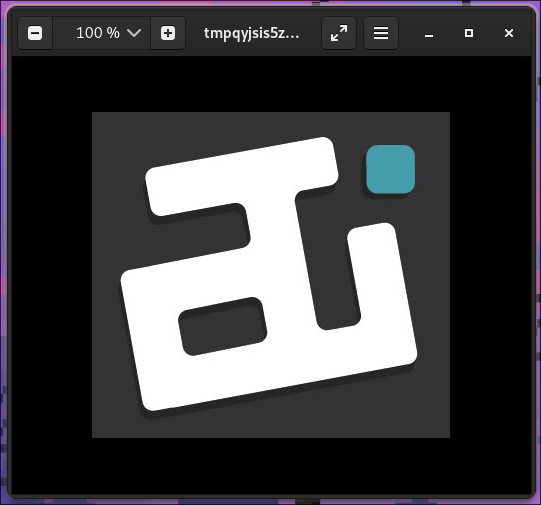
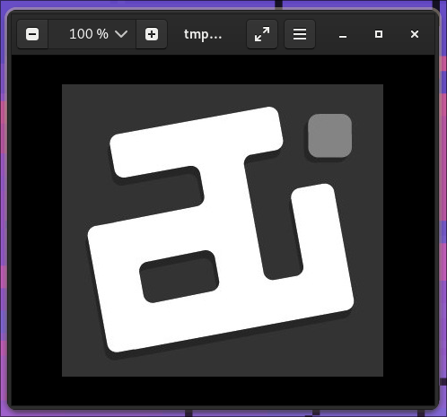
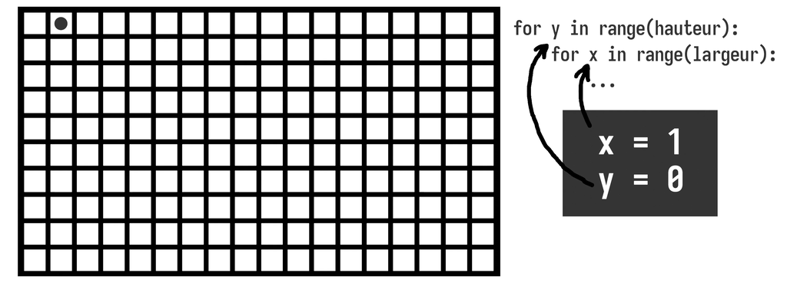
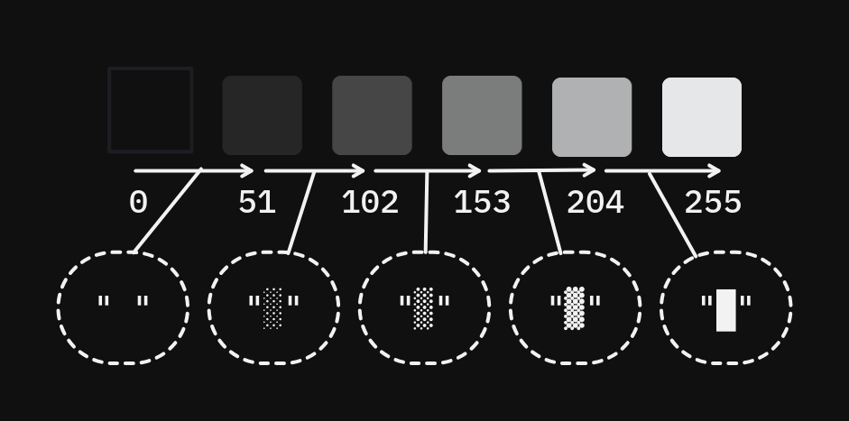
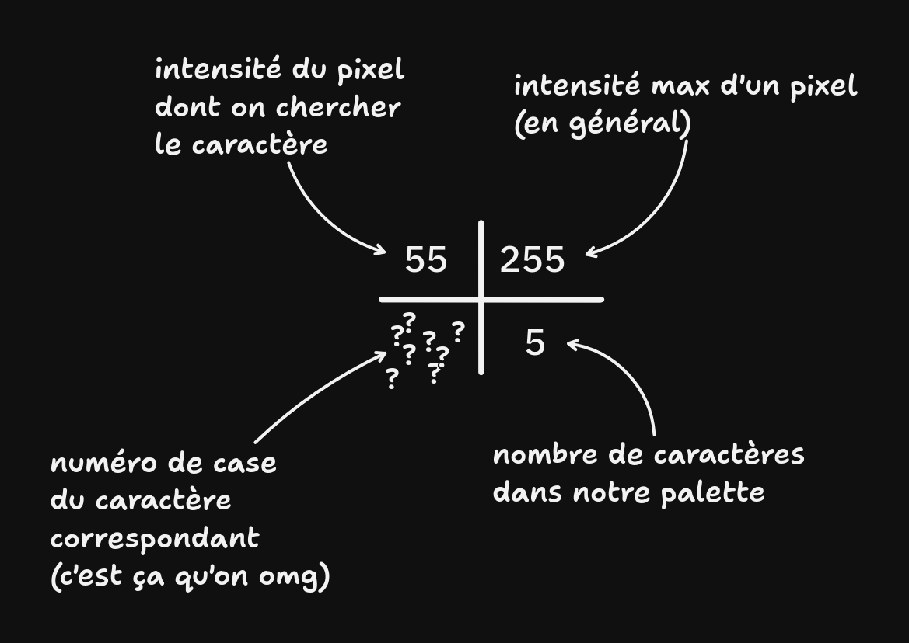

# TD4: Convertisseur d'image en ASCII 

## Intro

Aujourd'hui on va faire de l'ASCII Art à partir d'une image !

<pre style="font-family: monospace">
                            ░░░░▒▒▒▒▓▓▓▓░░      ░░░░░░      
                ░░░░░░▒▒▓▓▓▓▓▓██████████░░    ░░▒▒▒▒░░      
        ░░▒▒▒▒▓▓▓▓▓▓████████████████████▒▒    ░░▒▒▒▒▒▒      
        ▒▒████████████████████████████▓▓▒▒    ░░▒▒▒▒▒▒      
        ░░██████████████████████▓▓▒▒░░░░      ░░░░░░░░      
        ░░██████▓▓▓▓▓▓▒▒▒▒██████▓▓                          
          ▒▒▒▒░░░░        ▓▓████▓▓░░                        
                          ▓▓██████░░      ░░▒▒▒▒▓▓░░        
                          ▓▓██████▒▒      ▒▒██████▒▒        
                  ░░░░▒▒▓▓▓▓██████▓▓      ▒▒██████▓▓        
      ░░░░░░▒▒▓▓▓▓▓▓██████████████▓▓      ░░██████▓▓        
    ▒▒▓▓▓▓████████████████████████▓▓░░    ░░▓▓████▓▓░░      
    ▒▒██████████████████████████████░░      ▓▓██████░░      
    ░░████████████▓▓▓▓▒▒▒▒░░▓▓██████▒▒      ▒▒██████▒▒      
    ░░▓▓██████▒▒░░░░        ▒▒██████▒▒      ▒▒██████▒▒      
      ▓▓██████░░            ▒▒██████▓▓░░░░░░▓▓██████▓▓      
      ▓▓██████▒▒            ▒▒████████▓▓▓▓██████████▓▓░░    
      ▒▒██████▒▒  ░░░░▒▒▒▒▓▓▓▓████████████████████████░░    
      ▒▒██████▓▓▓▓▓▓██████████████████████████████▓▓▓▓░░    
      ░░██████████████████████████████▓▓▓▓▓▓▒▒▒▒░░░░        
      ░░▓▓██████████████████▓▓▓▓▒▒▒▒░░░░                    
        ▓▓██████▓▓▓▓▓▓▒▒▒▒░░░░                              
        ▒▒▒▒▒▒░░░░                                          
</pre>

(merci à Cidem pour l'idée 👉👈)


## 1 · Choisir une image

De préférence :
* Pas trop grande
* Avec un fort contraste

Pour les exemples, j'utiliserais cette magnifique image que vous connaissez probablement assez bien :


## 2 · Le module `pillow`

Afin d'ouvrir l'image, la décoder et lire chacun de ses pixels, nous allons, pous nous aider, utiliser le module Python `pillow` (autrefois appelé {abbr}`PIL (Python Imaging Library)`).

Il s'agit d'un module très populaire permettant de créer et manipuler des images de tout format, les ouvrir, redimensionner, cropper, convertir, leur appliquer des filtres... Et bien sûr les disséquer, voire les altérer pixel par pixel.

:::{note}
C'est ce même module que nous avons utilisé dans le [TD précédent](./td-glitch.md) afin de vérifier que notre image était bien lisible !
:::

:::{admonition} RAPPEL: Installer un module via `pip`
:class: tip, dropdown
Ouvrez une invite de commande Windows (ou un Terminal dans VSCode), tapez la commande suivante et validez avec {kbd}`ENTRÉE`.
```python
pip install pillow
```
:::


## 3 · Import de `pillow` (aka. `PIL`)

Maintenant que l'on est assuré que `pillow` se trouve sur notre machine, nous allons pouvoir ouvrir notre image !

👉 Mais tout d'abord, nous allons l'importer dans notre script.

:::{admonition} Importer depuis un module externe
:class: tip, dropdown

Afin d'utiliser la puissance de PIL dans notre script, nous devrons importer l'objet `Image`, contenu dans le module `PIL` (qui est le nom historique du projet sur lequel se base `pillow`, probablement conservé pour des raisons de compatibilité)

```python
from PIL import Image
```

Cette ligne permet d'aller "piocher" dans le module `PIL`, et d'y sortir l'objet `Image` et de le mettre à disposition du code de notre script, comme si nous l'avions déclaré et écrit nous-même dans notre propre `.py`.
:::


## 4 · Ouverture de l'image

👉 Nous allons enfin pouvoir ouvrir notre image, en utilisant la [méthode](./cours.md#les-méthodes) `.open()` de l'[objet](./cours.md#classes--objets) `Image`.

:::{note}
Cette méthode s'apparente énormément à la fonction `open()`, intégrée à Python, et que nous connaissons plutôt bien puisque nous l'avons utilisé lors des précédents TP.

Cependant, ces deux outils n'ont **rien à voir entre eux** et ne partage que leur nom, leur fonctionnement leur étant propre ;

par exemple, pour `Image.open()`, seul le chemin vers l'image à ouvrir sera nécessaire, **pas besoin** de spécifier un mode d'ouverture (les `'r'`, `'w'`, `'rb'`, `'wb'`...).
:::

:::{admonition} Ouvrir une image avec `pillow`
:class: tip, dropdown

Pour ouvrir une image, on utilise la ligne suivante :

```python
mon_image = Image.open("C:/chemin/vers/votre/image/ati_logo.png")
```

Cette ligne créera un [objet](./cours.md#classes--objets) de type [`Image`](https://pillow.readthedocs.io/en/stable/reference/Image.html), et le stockera dans la variable `mon_image`.

C'est cet objet qui nous permettra de manipuler notre image !
:::

:::{admonition} Astuce
:class: tip
Vous pouvez à tout moment de votre code visualiser l'état de l'image manipulée dans votre objet image en utilisant la méthode `.show()` de tout objet [`Image`](https://pillow.readthedocs.io/en/stable/reference/Image.html) !

Par exemple :

```python
mon_image = Image.open("C:/chemin/vers/votre/image/ati_logo.png")
mon_image.show()
```



Cependant, ne l'utilisez que pour tester/debugguer/visualiser temporairement, autrement la fonction vous affichera la fenêtre à chaque exécution et ce n'est pas forcément un comportement très désiré.
:::


## 5 · Conversion de l'image en nuances de gris

La majorité du temps, les ASCII art, stockés dans de simples fichiers textes, sont en noir & blanc ou en nuances de gris.

Afin de nous faciliter la vie lors de la lecture des valeurs de pixels un peu plus tard dans ce TD, nous allons d'ores et déjà convertir notre image couleur en **nuances de gris**.

Pour cela, nous pouvons utiliser la méthode [`.convert()`](https://pillow.readthedocs.io/en/stable/reference/Image.html#PIL.Image.Image.convert) intégrée à notre objet `mon_image` (qui est, pour rappel, de type [`Image`](https://pillow.readthedocs.io/en/stable/reference/Image.html)).

Cette méthode :
* Prend comme paramètre le mode de conversion que l'on désire, par exemple `"RGB"` pour les images en couleur, `"RGBA"` pour les images en couleur avec alpha, ou `"L"` pour les images en nuances de gris.
  
  C'est ce dernier mode `"L"` qui va nous intéresser ici !

* Retourne une copie de l'image qui a subit la conversion que l'on a demandé.

:::{admonition} **🚨 ATTENTION 🚨**
:class: warning
Attention à ce dernier point : la méthode ne **TOUCHE PAS** à votre objet et image original ! Elle RETOURNE un **NOUVEL objet [`Image`](https://pillow.readthedocs.io/en/stable/reference/Image.html)** qu'il va falloir stocker, afin de pouvoir continuer à travailler dessus.

A ce point là (et sauf si bien sûr, on l'écrase avec la nouvelle), on pourra oublier notre variable `mon_image` précédente :)
:::

👉 Utilisez la méthode `.convert()` de notre objet `mon_image` afin de convertir l'image en nuances de gris, et récupérez la nouvelle image convertie dans une variable nommée `mon_image_en_greyscale`.

:::{admonition} Convertir une image en nuances de gris
:class: tip, dropdown
```python
mon_image_en_greyscale = mon_image.convert("L")
```
:::




## 6 · Récupération des dimensions de l'image

En premier lieu, nous allons pouvoir récupérer les dimensions de notre image à présent ouverte, à savoir sa **largeur** et sa **hauteur** en pixels.

Pour cela, nous pourrons utiliser la liste stockée dans l'attribut [`.size`](https://pillow.readthedocs.io/en/stable/reference/Image.html#PIL.Image.Image.size) intégré à notre objet `mon_image_en_greyscale`, et où `pillow` a stocké, juste après décodage, les dimensions de l'image qu'il a pu réussir à déchiffrer sous forme d'une liste à 2 cases, contenant respectivement la largeur et la hauteur de l'image en pixels.

👉 Utilisez la liste contenue dans l'attribut `.size` afin de créer 2 variables `largeur` et `hauteur` contenant respectivement la largeur et la hauteur en pixel de votre image.

:::{admonition} Lecture des dimensions de l'image
:class: tip, dropdown

```python
largeur = mon_image_en_greyscale.size[0]
hauteur = mon_image_en_greyscale.size[1]
```
:::

:::{admonition} **🚨 ATTENTION 🚨**
:class: warning

`.size` est un [**attribut**](./cours.md#les-attributs) de `mon_image_en_greyscale` et non une [**méthode**](./cours.md#les-méthodes) !

Le fonctionnement d'un **attribut** s'apparente à 100% à une **variable**, mais qui serait intégrée à un objet. Ne lui mettez donc pas de `()` après son nom, sinon Python considèrera que vous essaierez d'appeler une **méthode** ! (qui, elles, s'apparentent à une fonction intégrée à un objet, tout comme `im.getpixel()` que nous verrons juste après)
:::


## 7 · Créer 2 boucles imbriquées pour parcourir l'image

Et c'est la partie tricky du TD.

👉 Il s'agira ici de créer 2 boucles **imbriquées**, qui permettront de parcourir l'ensemble des pixels de l'image, du coin supérieur gauche de l'image à son coin inférieur droit.

Pour cela, nous utiliserons une première boucle, qui se **répétera autant de fois qu'il y a de pixels en hauteur de l'image**. Et ce afin de la parcourir **ligne de pixels par ligne de pixels**. Nous utiliserons donc une boucle de type `for y in range(...)`, en utilisant la **variable contenant la hauteur de l'image** récupérée en [(6)](#6--récupération-des-dimensions-de-limage) comme paramètre du `range(  )`.

Ensuite, la seconde boucle, de nouveau de type `for x in range(...)`, sera à écrire **à l'intérieur** de la première (d'où l'**imbrication**), et elle se répétera autant de fois qu'il y a de pixels en largeur de l'image. Cette seconde boucle permettra ainsi de parcourir notre image de **gauche à droite**, et ce pour chaque ligne.

Ainsi, nous obtiendrons un bout de code qui répètera un bloc de code s'exécutant pour chaque pixel, de gauche à droite, de chaque ligne, de haut en bas.




## 8 · Lire le contenu de chaque pixel de l'image

Dans le bloc de code de cette double boucle imbriquée, nous obtenons 2 variables utilisables : `x` et `y` ! Ces deux variables correspondent aux coordonnées de chaque pixel de notre image, parcouru par la double boucle.

Nous allons pouvoir utiliser ces coordonnées pour récupérer la couleur (enfin, ici le niveau de gris) chaque pixel que nous allons convertir en ASCII.

Pour cela, nous utiliserons la méthode `.getpixel()`, qui :
* prend en unique **paramètre** une liste à 2 cases correspondant à chacune des coordonnées du pixel : `[x, y]`,
* **retourne** un nombre entier de `0` à `255` correspondant à l'"**intensité lumineuse**" du pixel.

👉 Récupérez cette valeur d'intensité du pixel retournée et stockez-là dans une variable `intensite_pixel`.

:::{admonition} Récupérer la valeur d'un pixel
:class: tip, dropdown

Pour récupérer la valeur d'un pixel en fonction de ses coordonnées, on écrit :

```python
intensite_pixel = mon_image_en_greyscale.getpixel([x, y])
```
:::

## 9 · Créer une liste pour la palette

A présent, pour chaque pixel que l'on lit, nous allons pouvoir déterminer par quel caractère nous allons pouvoir le remplacer. Commençons par définir l'ordre des caractères que nous utiliserons, du plus sombre au plus lumineux !

👉 Créez une liste contenant, pour chaque case et dans l'ordre de luminosité, chaque caractère qui vous servira pour composer votre palette.

:::{tip}
Quelques exemples de caractères que vous pouvez utiliser :

<pre style="font-family: monospace;"> .oO@</pre>

<pre style="font-family: monospace;"> ░▒▓█</pre>
:::




## 10 · Trouver le caractère correspondant à l'intensité du pixel de l'image

C'est l'autre partie tricky du TD. (mais en vrai ça va)

Il y a plusieurs solutions pour résoudre ce problème.


### SOLUTION 1

👉 Faites des conditions à la chaine pour définir tous les cas possibles de caractère en fonction de l'intensité du pixel en cours.

Par exemple :
* si le pixel à une intensité se trouvant entre `0` et `51`, alors on utilisera le caractère ` `
* si le pixel à une intensité se trouvant entre `51` et `102`, alors on utilisera le caractère `░`
* si le pixel à une intensité se trouvant entre `102` et `153`, alors on utilisera le caractère `▒`
* si le pixel à une intensité se trouvant entre `153` et `204`, alors on utilisera le caractère `▓`
* si le pixel à une intensité se trouvant entre `204` et `255`, alors on utilisera le caractère `█`

:::{admonition} if ... elif ... else
:class: tip, dropdown
Pour chainer de multiples conditions, vous pouvez utiliser l'instruction `elif` (littéralement *"else if"* = *"ou sinon"*) pour ajouter des conditions échéantes, à la suite d'une première condition `if` !

Cela vous permettra de tester plusieurs cas, par exemple :

```python
   if intensite_pixel >= 0 and intensite_pixel < 51:
      caractere = " "
   elif intensite_pixel >= 51 and intensite_pixel < 102:
      caractere = "░"
   elif intensite_pixel >= 102 and intensite_pixel < 153:
      caractere = "▒"
```
... et ainsi de suite.

Ici, si `intensite_pixel` est, disons, à `55`, alors la première condition va échouer (`intensite_pixel >= 0 and intensite_pixel`), son bloc de code sera sauté, pour passer directement à la 2e condition (`intensite_pixel >= 51 and intensite_pixel < 102`), qui elle sera valide.

Après exécution du bloc de code de la condition correspondant à l'expression valide, le reste des `elif` qui suivent seront ignorés !
:::

### SOLUTION 2 (plus cool, plus souple mais plus mathématique)

On le fera en correction mais grossièrement, vous pouvez faire une produit en croix (oui je sais c'est loin), par exemple si on chercher le caractère correspondant à un pixel d'intensité `55` parmis une palette de `5` caractères :



:::{note}
Ce produit en croix vous donnera *probablement* un nombre à virgule, que vous pouvez convertir en nombre entier (sans virgule, autrement dit on l'arrondit à l'inférieur) en utilisant fonction `int()` (oui, en le [convertissant/castant](./cours.md#casting) donc! cf. [TD3](./td-glitch.md#5--conversion-de-la-liste-altérée-en-bytearray))
:::


## 11 · Afficher le caractère

👉 Afficher le caractère correspondant au pixel en cours dans la console

:::{tip}
Vous pouvez utiliser `print(votre_caractere, end="")` afin d'afficher quelque chose sans qu'il n'y ait de retour à la ligne à la suite !
:::

Vous devriez avoir quelque chose dans ce style :

<pre style="font-family: monospace;">
░░▒▒▓▓░   ░░░           ░░░▒▓▓▓█████░  ░▒▒░       ░▒▒▓▓▓██████████▒  ░▒▒▒       ▒██████████████▓▒  ░▒▒▒       ░███████████▓▒░░   ░░░░       ░███▓▓▓▒▒███▓                  ▒▒░░    ▓██▓░                         ▓███░   ░▒▒▓░                 ▓███▒   ▒███▒             ░░▒▓▓███▓   ▒███▓       ░░░▒▓▓▓███████▓   ░███▓      ▒▓▓████████████▓░  ░▓██▓░     ▒███████████████░   ▓███░     ░██████▓▓▒▒░▓███▒   ▒███▒     ░▓███▒░░    ▒███▒   ▒███▒      ▓███░      ▒███▓░░░▓███▓      ▓███▒      ▒████▓▓█████▓░     ▒███▒ ░░▒▒▓▓████████████░     ▒███▓▓▓███████████████▓▓░     ░███████████████▓▓▓▒▒░░       ░▓█████████▓▓▒▒░░              ▓███▓▓▓▒▒░░                   ▒▒▒░░                                                                                 
</pre>

C'est un début, mais il manque quelque chose.

## 12 · Retour à la ligne

En effet, toutes les lignes se succède SANS retour à la ligne !

👉 À la fin de la boucle itérant sur **chaque ligne** (c'est à dire, **après** que tous les pixels de la ligne ait été parcourus), faites un retour à la ligne.

:::{admonition} "Afficher" un retour à la ligne
:class: tip
2 solutions :
* Utilisez le caractère spécial `\n` qui représente un **retour à la ligne** et sera automatiquement "transformé" en tant que tel
* Faites juste un `print()`. Ca n'affichera rien, mais ça entrainera un retour à la ligne dès le prochain `print` quel qu'il soit.
:::

<pre style="font-family: monospace;">
              ░░▒▒▓▓░   ░░░   
        ░░░▒▓▓▓█████░  ░▒▒░   
    ░▒▒▓▓▓██████████▒  ░▒▒▒   
    ▒██████████████▓▒  ░▒▒▒   
    ░███████████▓▒░░   ░░░░   
    ░███▓▓▓▒▒███▓             
     ▒▒░░    ▓██▓░            
             ▓███░   ░▒▒▓░    
             ▓███▒   ▒███▒    
         ░░▒▓▓███▓   ▒███▓    
   ░░░▒▓▓▓███████▓   ░███▓    
  ▒▓▓████████████▓░  ░▓██▓░   
  ▒███████████████░   ▓███░   
  ░██████▓▓▒▒░▓███▒   ▒███▒   
  ░▓███▒░░    ▒███▒   ▒███▒   
   ▓███░      ▒███▓░░░▓███▓   
   ▓███▒      ▒████▓▓█████▓░  
   ▒███▒ ░░▒▒▓▓████████████░  
   ▒███▓▓▓███████████████▓▓░  
   ░███████████████▓▓▓▒▒░░    
   ░▓█████████▓▓▒▒░░          
    ▓███▓▓▓▒▒░░               
    ▒▒▒░░                     
</pre>

Voilà est mieux !


## 13 · Si vous êtes arrivé·e jusque là

Déjà, bravo ! 🎉

Ensuite, vous pouvez :

* Ajouter un redimensionnement de l'image d'entrée **dès son ouverture** afin de rapetisser et contrôler sa taille, peu importe l'image que vous choissez (utilisez la méthode `.resize([nouvelle_largeur, nouvelle_hauteur])` de l'objet `Image`)

* (et c'est encore mieux si vous respectez le ratio de l'image durant le redimensionnement.....)

* Ecrivez dans un fichier plutôt que dans la console ! (cf `open()`, `.write()`, etc)
