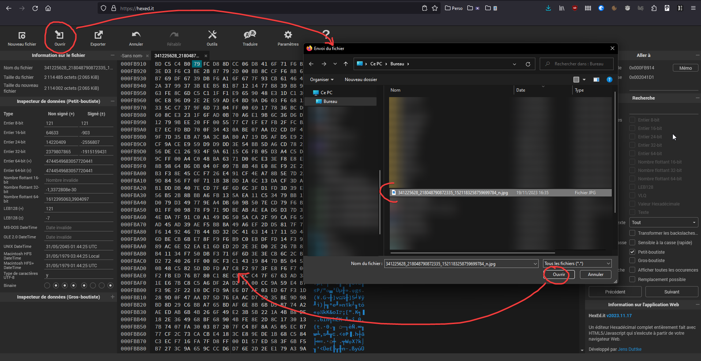
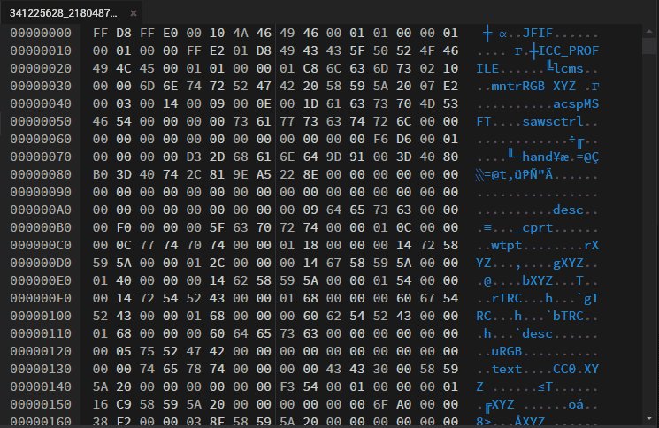
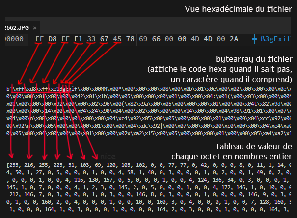

# TD3: Glitch

## Intro

Aujourd'hui on va faire glitcher une image ! Puis en faire une animation !


## PARTIE 1

Pour comprendre le principe du glitch art sur des images, on va commencer par corrompre un fichier manuellement et voir les résultats.
Ainsi, on pourra comprendre et automatiser le processus pour le faire à la chaîne :)


### a · Télécharger un JPEG

(PROTIP: les images téléchargées depuis Facebook glitchent PARTICULIÈREMENT BIEN, probablement parce qu'elles ont une recompression bien crade)


### b · Ouvrez-le en utilisant un éditeur hexadécimal

Pour cet exemple, je vous conseille d'utiliser un éditeur tel que l'app Web [https://hexed.it](https://hexed.it/).




### c · Allez en plein milieu du fichier, sélectionnez quelques lignes et supprimez-les avec la touche {kbd}`Suppr`




### d · Sauvegardez (avec le bouton `Exporter`)


### e · Ouvrez l'image exportée


### f · Recommencez

Revenez à [(c)](#c--allez-en-plein-milieu-du-fichier-sélectionnez-quelques-lignes-et-supprimez-les-avec-la-touche) jusqu'à obtenir des résultats perceptibles.


### Conclusion de la partie 1

Dans ce TD, nous allons faire un script afin de produire cet effet automatiquement plusieurs fois d'affilée, et en faire une animation !


## PARTIE 2

### 1 · Ouvrir le fichier

👉 Ouvre le fichier image à glitcher en **mode binaire**, au moyen de la fonction `open()` en mode `rb`.

:::{admonition} Ouverture d'un fichier en mode binaire
:class: tip, dropdown
Pour ouvrir un fichier en mode binaire, on utilise la fonction intégrée à Python `open()`.

```python
fichier = open("C:/Chemin/Vers/Le/Fichier.jpg", "rb")
```

Cette fonction prend 2 paramètres :
* un premier paramètre correspondant au chemin vers le fichier à ouvrir
* le mode d'ouverture du fichier : ici `rb`. 
  `r` correspond à ***read***, donc lecture, et `b` à ***binaire*** :)

Elle renvoie un [**objet**](./cours.md#objet) pointant vers le fichier, objet qui possède tous les mécanismes permettant de lire et écrire le fichier ! (après l'avoir ouvert)
:::

:::{note}
Pour ouvrir un fichier texte normal, le mode `"r"` suffirait. Mais comme on veut péter des trucs à l'échelle de l'octet, on préfèrera le mode *binaire*.

L'autre souci majeur pour notre cas, est que le mode de lecture simple tente de décoder le contenu du fichier en partant du principe qu'il s'agisse d'un texte fait de caractères lisible par les humains, et encodés en tant que tel.

Cela nous pose particulièrement souci ici, puisque les données des images que l'on souhaite lire et altérer ne sont pour la plupart pas des caractères encodés interprétables par l'humain.

Ainsi, dans ce mode, la méthode `.read()` échouera à interpréter certaines parties du fichier et fera crasher le programme.

tl;dr:
* mode *texte* `'r'` => humains (fichier texte, configuration, documentation...)
* mode *binaire* `'rb'` => machines (image, vidéo, zip, exécutable...)
:::


### 2 · Lire et récupérer le contenu du fichier

👉 Lire le fichier afin de stocker son contenu dans une variable grâce à la méthode `.read()` de l'objet pointeur de fichier que l'on a créé en [(1)](#1--ouvrir-le-fichier), retourné par l'appel à la fonction `open`.

:::{admonition} Lecture du contenu d'un fichier
:class: tip, dropdown
Pour récupérer le contenu d'un fichier, on utilise la méthode `.read()` de l'objet pointant vers le fichier que l'on a ouvert plus haut.
```python
contenu_du_fichier_brut = fichier.read()
```

Cette méthode lira notre fichier/image et retournera son contenu.
:::


👉 Une fois le travail sur le fichier terminé, fermez le fichier afin de le rendre disponible au reste de votre OS et de vos applications.

Cela évite le fameux *"Ce fichier est déjà utilisé par un autre processus"*.


:::{admonition} Fermeture d'un fichier
:class: tip, dropdown
Pour fermer un fichier et ainsi laisser le reste du monde y accéder de nouveau, vous pouvez utiliser la méthode `.close()` de l'objet pointeur de fichier que vous avez récupéré en [(1)](#1--ouvrir-le-fichier).

```python
fichier.close()
```

Ce n'est pas _obligatoire_, mais il s'agit d'une bonne pratique de programmation.
:::


### 3 · Transformation du contenu récupéré en *liste*

La valeur retournée par `.read()` en mode binaire est une valeur de type *bytearray*. Il s'agit littéralement d'un *tableau d'octets*, à savoir le contenu brut de notre fichier stocké octet par octet sous la forme d'une sorte de *liste*, et non interprété par Python.

:::{admonition} Définition d'un octet
:class: note, dropdown

Un *octet* est l'unité de stockage de données informatiques la plus petite, et constituée de *8 bits*, 1 bit correspondant à l'unité stockant le fameux 0 ou 1.

D'où **OCT**et... octo... huit... tu l'as?
:::

Le problème du *bytearray*, bien qu'il soit très similiaire à une [liste](./cours.md#listes), est que l'on ne peut éditer son contenu case par case. Ce qui est bien dommage puisque dans le cadre de notre corruption de données, c'est exactement ce que l'on souhaiterait faire...

Il va donc falloir que l'on [convertisse](./cours.md#casting) (ou *caste*) cette variable de type _bytearray_ en une _[liste](./cours.md#listes)_, un type de valeur bien plus classique que nous manipulons depuis notre premier cours. Et qui est donc tout à fait éditable, case par case.

👉 Convertissez la variable de type *bytearray* `contenu_du_fichier_brut` en une liste stockée dans une variable nommée `contenu_du_fichier`.

:::{admonition} Conversion ou *casting* d'une valeur
:class: tip, dropdown
Pour convertir la valeur d'une variable d'un type à l'autre, nous pouvons [caster](./cours.md#casting) notre variable de type `bytearray` afin de recopier les valeurs contenu de chacunes de ses cases dans une nouvelle variable `list`.

En Python, cela correspond à appeler une fonction correspondant au type de destination désiré, avec comme unique paramètre la variable ou la valeur à convertir.

Ici, pour convertir une variable `contenu_du_fichier_brut` en *list*, on écrirait :

```python
contenu_du_fichier = list(contenu_du_fichier_brut)
```

D'ailleurs, vous pourrez tout à fait utiliser ce procédé pour, à l'inverse, convertir une variable de type *list* en *bytearray*, en écrivant `bytearray(votre_variable_a_convertir)` !
:::

:::{admonition} FYI EXPLICATION BONUS : Quelques explication non exhaustives sur les différences entre bytearray et liste
:class: info, dropdown

*⚠️ C'est vraiment giga bonus donc si vous comprenez pas tout c'est pas grave du tout (mais hésitez pas à me questionner si le sujet vous intéresse)*

En gros :

* Un *byte* est un *octet*, soit une unité d'information composée de 8 bits, soit un nombre qui peut aller de 0 à 255.
  
* Un *bytearray* est un tableau d'*octets* : il y a donc un *octet* par case. Il ne permet de ne stocker rien d'autre qu'un *octet*, contrairement à une *liste* qui permet de stocker tout et n'importe quoi.
  
* Un *byte/octet* peut être représenté par un code *hexadécimal*, permettant de représenter un nombre de 0 à 255 suivant une numérotation en base 16 allant de 00 à FF. 
  (base 16 ça veut dire qu'au lieu de compter 0 1 2 3 4 5 6 7 8 9 10 comme en base 10, on peut compter de 0 à 16 en comptant 0 1 2 3 4 5 6 7 8 9 A B C D E F. Ca veut dire qu'avec 1 chiffre hexa on peut compter jusqu'à 16, et en mettant 2 chiffres hexa côte à côte on peut compter jusqu'à 255)
  
* Un *bytearray* est fait pour être une structure de données brute pouvait être interprétée suivant différents encodages, ceux-ci définissant quel enchainement d'octet correspond à quel caractère. C'est un de ses usages spécifiques principaux, et c'est pour cette raison qu'il est aussi peu flexible. Contrairement aux [listes](./cours.md#listes).


Vous pouvez avoir un aperçu dans l'image ci-dessous des différences entre respectivement :

* l'information brute de ce qui est stocké dans un fichier, octet par octet (suivant une notation hexadécimale)
* les mêmes informations stockées dans un *bytearray*, quand on `print` ce dernier
* la liste correspondant au *bytearray* après qu'on l'ait *[converti/casté](./cours.md#casting)*, et que chaque octet se retrouve ainsi individuellement placé dans cette liste sous forme de nombres entiers de 0 à 255.
 
  

**NOTE:**
: Dans cette représentation du *bytearray*, les *octets* comportant potentiellement un caractère affichable sont montrés (les caractères affichables étant par exemple les caractères alphanumériques, spéciaux, etc), mais le contenu du reste des octets non interprétables sont affichés sous forme de code hexadécimal, avec le petit préfixe `\x` suivi de leur valeur. (ce préfixe veut dire en gros *"hey il va y avoir un code hexa juste après (mais jsp c koi, faites vos recherches)"*)
:::

### 4 · Bordélisation

#### a) Localisation d'une case random

On va maintenant localiser une case aléatoire de notre tableau `contenu_du_fichier`, afin de changer sa valeur (et commencer à foutre le bordel dans notre image du coup).

👉 Tirez un numéro de case au hasard de votre tableau `contenu_du_fichier`.

:::{tip}
Le contenu de notre fichier étant maintenant stocké dans une liste, on peut donc connaitre la taille de cette liste avec la fonction `len()`, et choisir une case aléatoire en utilisant notre vieil ami `random.randint()` (voir le [TD2](./td02.md#1--crée-une-liste-et-remplis-là-de-100-nombres-aléatoires)).
:::

#### b) Changement de la valeur de la case

👉 Une fois un numéro de case aléatoire du tableau choisi, changer sa valeur par un **nombre entier** entre `0` et `255`.

Si t'es pas inspiré, mets lui juste `0`.

:::{admonition} RAPPEL : Comment accéder à une case particulière d'une liste
:class: tip, dropdown
Pour accéder à la case d'une liste, on écrit le numéro de case désiré entre crochets `[]` suivant directement le nom de la variable contenant la liste à accéder.

**Exemple 1** : remplacer le contenu de la case 3 (la 4e) de la liste `tableau` par la valeur numérique `68`
```python
tableau[3] = 68
```

**Exemple 2** : lire le contenu de la case 0 (la toute première) de la liste `tableau` et stockage dans une variable
```python
contenu_premiere_case = tableau[0]
```
:::


### 5 · Retransformation de la liste en *bytearray*

Maintenant que l'on a glissé cette petite valeur intruse et coquine en plein milieu de notre fichier, on va pouvoir écrire notre image corrompue afin de constater les résultats de la corruption.

On va cependant devoir repasser notre liste d'octets en *bytearray* afin de pouvoir l'écrire en *mode binaire* à la section suivante.

👉 Reconvertir `contenu_du_fichier` en *bytearray*, et stocker le résultat de cette conversion dans une variable qu'on pourrait appeler `nouveau_contenu_du_fichier_brut` par exemple.

:::{tip}
(Re)voir le tip du [(3)](#3--transformation-du-contenu-récupéré-en-liste) sur la conversion des types de valeurs (ou *"casting"*).

Sauf que cette fois-ci, il faudra faire l'inverse, à savoir que la conversion ne sera plus *bytearray* -> *list* mais *list* -> *bytearray*.
:::


### 6 · Ouverture d'un nouveau fichier image corrompu en mode écriture binaire

👉 Ouvrez un nouveau fichier qui recevra le contenu des nouvelles données corrompues de notre image.

:::{tip}
(Re)voir le tip du [(1)](#1--ouvrir-le-fichier) expliquant comment ouvrir et manipuler un ficher avec la fonction `open()`, en utilisant cette fois-ci le mode `wb` (`w` = *write* et `b` = *binaire*).
:::

:::{warning} 
Attention, `open` en mode `w` créera le fichier s'il n'existe pas et 🚨 l'**ÉCRASERA 🚨 SANS 🚨 SOMMATION** 🚨 s'il existe déjà (par un fichier totalement vide dans un premier temps).

Faites donc bien gaffe au chemin du fichier que vous mettez en paramètre du coup, évitez que cela soit une DLL system32 notamment
:::


### 7 · Ecrire le contenu du nouveau fichier

👉 Écrire le nouveau fichier avec les nouvelles données altérées, que nous avons reconverti en bytearray à l'étape [(5)](#5--retransformation-de-la-liste-en-bytearray).

:::{admonition} Écriture dans un fichier
:class: tip, dropdown
Vous pouvez écrire dans un fichier **ouvert en mode écriture** en utilisant la méthode `.write()` de l'objet retourné par la fonction `open` ayant servi à ouvrir le fichier.

Cette méthode prend un unique paramètre correpondant aux données à inscrire dans le fichier.

```python
fichier.write(nouveau_contenu_du_fichier_brut)
```
:::

:::{warning}
Ne pas oublier de fermer le fichier dès que vous avez terminé de travailler avec ! (voir le tip en [(2b)](#2--lire-et-récupérer-le-contenu-du-fichier))
:::

### Conclusion partie 2

Vous devriez avoir une belle image comprenant, avec un peu de chance, quelques glitchs mineurs! Non ? Alors relancez-le...

Ça ne fait toujours rien ? Et bien cela signifie qu'il va falloir taper [P̸̢̢̖̭̤̹̳̖̳̥̹̖̈́̿͌͒̎͜ͅL̸̡̪̣̭̞̝̥̮̺͔̰͚̣̠̏͌̌̏̇͜U̸̧̫͉͙͙̿̀̐͝Ṡ̸͉̺̦͈̮͇̘̲̯̱͚͍̓̄͜ ̵̛̲͎̉́͒̐̿͘͘F̵͕̄̇̐̍O̵̢̢̺̤͆͗̂̄̈́̇̌̿̃̚̚͠R̶̢̢̧̨͈͕̯̯͔͕͉̮̣̠̠̐̆̀͠T̴̡͈̩̞̜͍͓̔̄](#partie-3).


## PARTIE 3

Ok alors il va probablement falloir beaucoup d'essais pour obtenir le moindre glitch. Corrompre un octet dans l'ensemble d'un JPEG pouvant en contenir des millions... Ca ne sera probablement pas suffisant pour avoir un effet visible.

Du coup... On va multiplier la destruction :<


### 1 · Répéter la corruption

👉 Mettez toute la partie du code de la partie 2 qui injecte les mauvaises informations dans une boucle `for ... in range(...)`, afin de faire en sorte que ce code aille corrompre à répétition différents endroits aléatoires de notre fichier.

:::{tip}
S'il y a toujours aussi peu de corruption alors que votre code se répète bel et bien, faites bien attention à ce que vous faites boucler ! Peut-être que trop choses ont été incluse dans le bloc de code.

Par exemple, si vous lisez le fichier avec `.read()` à chaque itération de la boucle, cela sera comme si vous recommenciez le processus de corruption du début, à chaque itération de la boucle, car cela correspond à repartir d'un fichier sain, plutôt que multiplier les couches de corruption sur les mêmes données que vous avez lu depuis le fichier.
:::

Les destructions sont assez visibles ? Peut-être trop ? Ajustez le nombre d'itérations de la boucle, pour faire péter plus ou moins d'octets, en fonction de l'effet désiré, ou si l'opération rend le fichier illisible.

Dès que c'est bon, on va animer tout ça !


### 2 · Génération d'une série d'images glitchées

Maintenant que l'on a une belle image glitchée, on peut très facilement en faire une série !


#### 2a · Boucle `for` pour générer plein d'images

👉 Faites une nouvelle boucle `for i in range(...)` qui ENGLOBE l'ensemble de la boucle que vous avez défini en [(1a)](#1--répéter-la-corruption), et qui fera donc répéter **l'ensemble de l'opération de destruction de l'image, de l'ouverture du fichier original à l'écriture de l'image corrompue**.

Le but de cette boucle sera de générer un certain nombre de versions glitchées de notre fichier image originale. Ce n'est pas grave si dans un premier temps, elle écrase toujours le même fichier image, on verra comment nommer nos différentes frames dans la partie suivante.


#### 2b · Générer un nom unique et numéroté pour chaque frame à générer

Chacune de ces images sera numérotée avec un numéro d'image *padded*.

:::{admonition} C'est quoi le padding?
:class: note

*to pad* signifie *remplir*, et implique ici l'action de venir ajouter un certain nombre de caractères à une chaine de caractères afin que cette chaine fasse AU MOINS une certaine taille.

Dans le cas présent, on va vouloir ajouter autant de `0` qu'il faudra, à gauche de notre nombre, afin d'avoir toujours au moins 3 chiffres dans notre chaîne de caractères.

Par exemple :
* `4`-> `004`
* `23`-> `023`
* `420`-> `420`
:::


Ces noms seront définis en fonction d'un compteur que l'on incrémentera de fichier en fichier, et qui ressembleront donc à :

* `Glitch_001.jpg` pour le premier fichier de la liste
* `Glitch_002.jpg` pour le deuxième, etc...

👉 Pour cela, nous allons **créer une nouvelle variable**, dans laquelle nous concaténerons :
* le préfixe de notre fichier (`"Glitch_"`)
* le numéro de frame avec padding (voir ci-dessous) (`001`, `002`...)
* l'extension (`.JPG` donc).

:::{admonition} Padding d'une chaine de caractère (aka "faire une belle numérotation")
:class: tip, dropdown
Pour obtenir un nombre avec un "**padding**", on utilisera la méthode `.zfill()`, directement intégrée aux valeurs de type chaine de caractères.

```python
str(9).zfill(3) # Ceci renverra -> 009 :)
```

Petite explication sur cette ligne :
* on convertit le nombre `9` au format chaine de caractère (*string*),
* puis on utilise la méthode `zfill` intégrée au type `string` pour ajouter le nombre de `0` devant le nombre pour que la taille de la chaine de caractères finale corresponde AU MOINS à la valeur renseignée en paramètres de `zfill`.
* cette méthode est disponible sur chaque variable de type chaîne de caractère. Par exemple : `"9".zfill(3)` c'est valide

Exemples d'utilisations de `zfill` :
```python
"12".zfill(6)    # Retournera "000012"
```
```python
"9754".zfill(3)  # Retournera "9754"
```
```python
"8".zfill(2)     # Retournera "08"
```
```python
nombre_en_string = "23"
nombre_en_string_avec_padding = nombre_en_string.zfill(5)
print(nombre_en_string_avec_padding)  # Affichera "00023"
```
:::


### 3 · Détecter et recommencer les images illisibles

Il y a un très fort risque que certaines images que nous allons générer soient illisibles. Puisque l'on tape au hasard dans le fichier, il est possible que nous supprimions trop d'information, ou bien des informations primordiales au décodage du fichier (certaines métadonnées de l'en-tête du JPG notamment).

On va donc vérifier, après l'écriture de chaque image, que celle-ci est bel et bien lisible. Et si c'est le cas, on recommencera toute la séquence de corruption une nouvelle fois, du début, pour générer la même frame.

#### 3a · Installer la librarie `pillow`

👉 Pour cela, nous allons faire appel au module de manipulation d'images `pillow`, qu'il faudra installer via le gestionnaire de modules `pip` (ℹ️ Voir [la partie du support cours à ce sujet](./cours.md#télécharger-de-nouveaux-modules)).

#### 3b · La fonction `isImageValid()`

👉 Copiez-collez la fonction ci-dessous tout en haut de votre script :

```python
from PIL import Image

def isImageValid(path):
	try:
		imageFile = Image.open(path)
		imageFile.save(path)
		return True
	
	except:
		return False
```
  
Cette fonction prend le chemin d'une image en paramètre, et retourne `True` si l'image est valide et `False` sinon.

Elle tente d'ouvrir l'image avec la librairie de manipulation d'image PIL, qui crashera à la sauvegarde (car c'est le moment où la libraire essaie de décoder l'image) si elle n'est pas valide.
Le crash est attrapé par l'instruction de gestion d'erreur `try ... catch` (que nous n'avons pas encore abordé), qui fera en sorte que la fonction retourne `False` si un tel évènement se produisait.

Oui, c'est un peu bourrin. Mais ça fonctionne à tous les coups.

#### 3c · Recommencer la génération si l'image est invalide

Utilisez la fonction `isImageValid()` afin de vérifier si l'image que l'on vient de générer est valide.

Si ce n'est pas le cas, c'est-à-dire si la fonction renvoie `False`, alors on regénérera un nouveau fichier glitché, jusqu'à ce que la frame soit lisible.

:::{admonition} INDICE
:class: tip, dropdown
L'utilisation d'une boucle `while` prendra tout son sens pour régler cette problématique !

En effet, on souhaite ici qu'un bloc de code (ici la partie du programme générant une frame en particulier) s'exécute jusqu'à ce qu'une condition soit remplie (la validité d'une image).

Ce qui décrit parfaitement une problématique à laquelle peut répondre une boucle `while` :)
:::


### 4 · Encoder la séquence d'image en vidéo

Une fois la séquence d'images générée, encodez-là en MP4 avec `ffmpeg` !
De nouveau, n'hésitez pas à consulter le [[TD3#6 · Encodage de la vidéo|TD sur le timelapse]] pour cette étape.