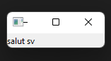
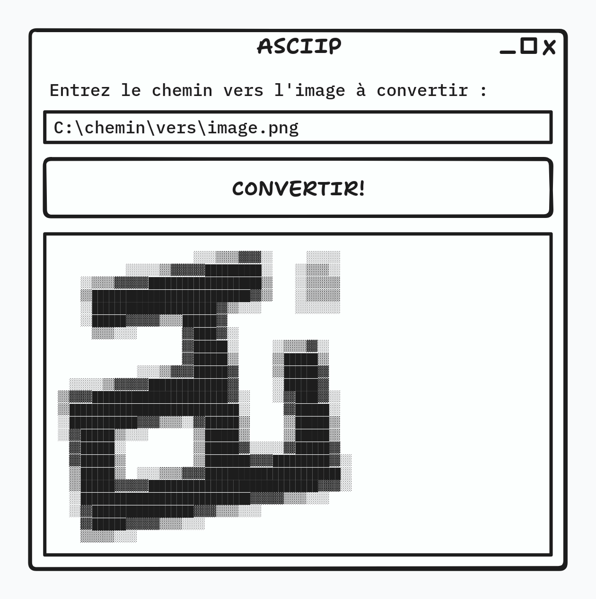
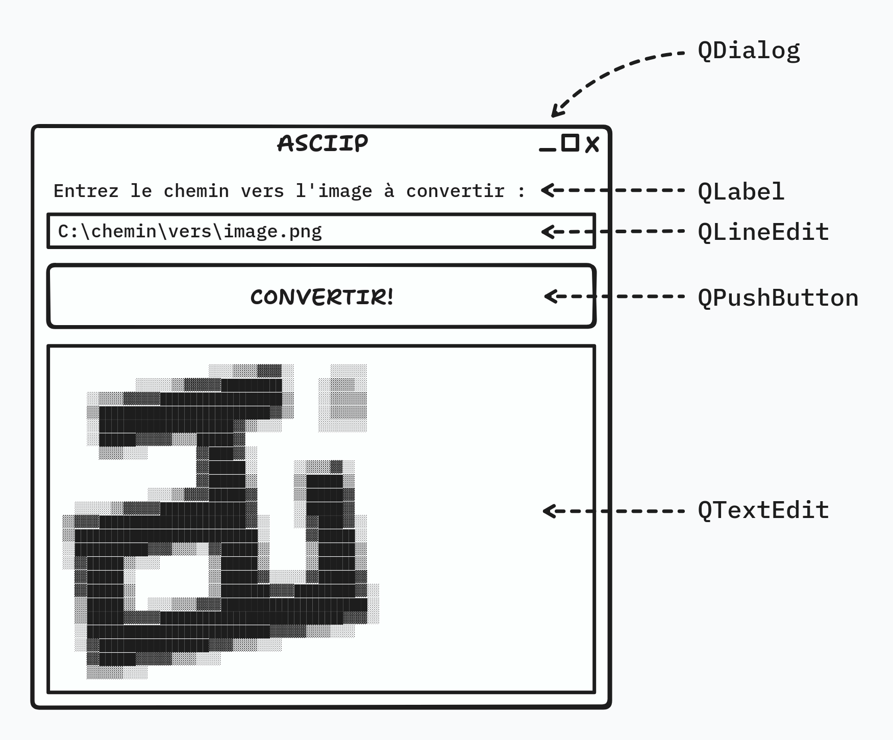
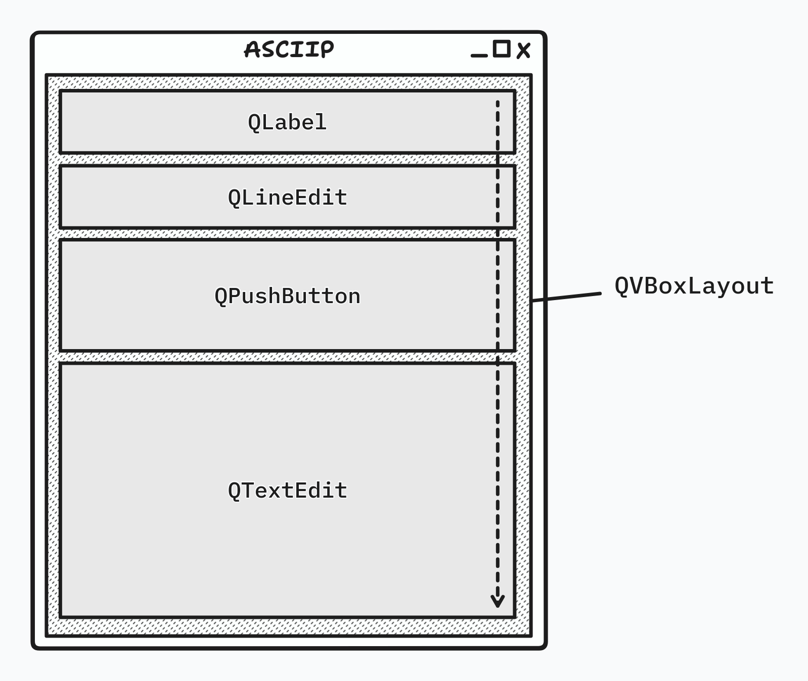
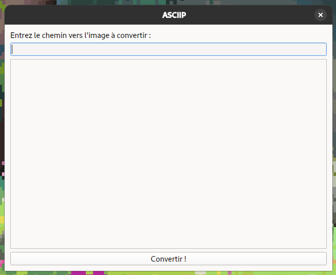
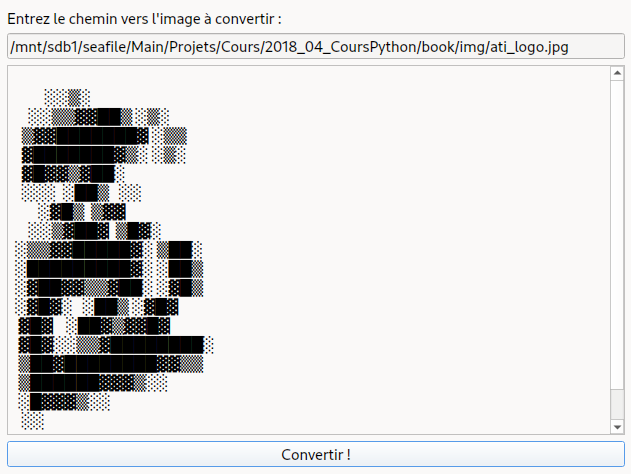
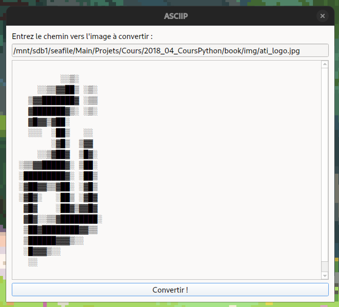

# TD5: Interface graphique


## Intro

Dans ce TD, nous allons reprendre le convertisseur d'image en ASCII art et lui créer une petite interface afin d'en faire un outil pleinement fonctionnel !


## Partie 1

Prenons le temps, en premier lieu, de vous familiariser avec la base de la base de PySide, le module Python que nous utiliserons pour programmer notre interface graphique.


### 1 · PySide

PySide est un des modules Python de création d'interface les plus utilisés (notamment en prod).

Il est basé sur la très puissante librarie C++ **Qt**, dont l'ensemble des fonctionnalités seront ainsi utilisables dans nos programmes Python afin de faire aussi bien des petits outils avec interface graphique que des grosses applications complexes, et ce, sans avoir à se fader un langage aussi complexe que le C++.

De plus, l'avantage majeur de cette librarie est qu'elle est **multiplateforme**, c'est-à-dire qu'un code écrit avec pourra être utilisé **indifféremment sur tous les systèmes d'exploitation**, que ce soit Windows, Linux ou macOS.


### 2 · Installer

Comme pour `pillow` dans le [TD ASCII](./td-ascii.md), ouvrez une Invite de Commande et utilisez `pip` pour [installer le module](./td-ascii.md#2--le-module-pillow) nommé `PySide6`.


### 3 · "Hello World" ou création d'une fenêtre basique

Un *Hello World* est le programme minimum que l'on peut faire pour tester un langage ou une librairie.
Ici, on va juste faire une petite fenêtre pour afficher un texte.


#### 3a) Importer `QApplication` et `QLabel`

👉 Importez les classes `QApplication` et `QLabel` depuis le module `PySide2.QtWidgets`.

:::{admonition} Importer certains éléments particuliers d'un module
:class: tip, dropdown
Pour importer un élément particulier se trouvant dans un module, par exemple ici, la classe `QApplication` du module `PySide6.QtWidgets`, on peut faire :

```python
import PySide6.QtWidgets
```

avant de pouvoir utiliser le contenu du module comme ceci :

```python
app = PySide6.QtWidgets.QApplication()
```

Mais on peut également écrire :

```python
from PySide6.QtWidgets import QApplication
```

qui permet d'utiliser directement la classe `QApplication` comme ceci :

```python
app = QApplication()
```

Cette dernière version est plus courte, et évite de devoir se retaper toute la hiérarchie de modules et sous-modules à chaque utilisation d'un élément présent dans un module/librairie.
:::


#### 3b) Instancier un objet `QApplication`

👉 Créer une [instance](./cours.md#objet) de la [classe](./cours.md#classe) `QApplication` et la stocker dans une variable nommée `app`.

:::{admonition} Instancier une classe / Créer un objet à partir d'une classe
:class: tip, dropdown
Pour instancier une classe, la syntaxe est **la même** que lorsque l'on **appelle une fonction** : on nomme la classe et on fait suivre son nom de `()`.

L'instruction retournera notre nouvel objet, instancié depuis la classe, qu'on pourra donc stocker dans une variable.

```python
app = QApplication()
```
:::


#### 3c) Créer un widget `QLabel`

:::{admonition} Qu'est-ce qu'un Widget?
:class: info
C'est un élément composant une interface : un bouton, une case à cocher, un champ de texte, une image, un texte...
 
Chaque widget correspond à une classe de PySide/Qt.
 

:::

Pour créer un widget, on instancie la [classe](./cours.md#classes--objets) correspondante au widget que l'on désire afficher.

Ici, nous souhaiterons commencer par afficher un widget qui ne sert qu'à afficher du texte : `QLabel`.

Ce widget pourra afficher le texte de votre choix, en lui donnant en paramètre une chaîne de caractère avec le texte en question !

Une fois instancié, vous pouvez l'afficher en utilisant sa méthode `.show()`.

```python
label = QLabel(text="Coucou.")
label.show()
```

:::{note}
Le premier widget créé à l'extérieur d'une hiérarchie de widgets deviendra la fenêtre principale de l'application. Nous verrons en [partie 2](#partie-2) comment créer des interfaces plus complexes en disposant des widgets dans une fenêtre :)
:::


#### 3d) Exécuter l'interface graphique

👉 Une fois l'interface définie, on peut démarrer notre application graphique en appelant la méthode  `exec()` de notre instance de `QApplication`.

```python
app.exec()
```

:::{warning}
Cette ligne doit toujours se trouver A LA FIN du programme.
:::

:::{admonition} Que fait `exec()` ?
:class: info

Cette méthode démarre la boucle d'événements de notre programme : une boucle infinie qui va bloquer l'exécution de la suite du programme mais qui va se charger de récupérer en permanence les évènements, interactions avec l'utilisateur, l'interface et l'OS, changements d'états du programme, etc.
:::




## Partie 2

Après cette introduction, nous allons assembler notre interface pièce par pièce, éléments dont nous définirons le comportement en les connectant à de petites fonctions.

Mettez de côté le "Hello World" de la partie 1 et repartez d'un nouveau fichier `.py` !


### 1 · Dessin de l'interface

On va faire une interface pour notre convertisseur d'images en ASCII, et afficher le résultat dans une zone de texte !

Notre interface ressemblera grossièrement à ceci :



Comme expliqué dans l'encadré de la [partie 1c)](#c-créer-un-widget-qlabel), chaque élément de notre interface se trouve être un *widget*, chaque type de *widget* correspondant à une classe différente parmi celles fournies par `PySide6`.



Les différents éléments de notre interface sont :
* une fenêtre **QDialog** : un fenêtre vide dans lequel nous imbriquerons nos autres *widgets*, disposés selon un *layout* particulier.
* un widget **QLabel** : affiche un simple texte, **non éditable** par l'utilisateurice, permettant de transmettre des informations.
* un widget **QLineEdit** : un champ de texte, **éditable** par l'utilisateurice. Permet de récupérer des informations de sa part.
* un widget **QPushButton** : un bouton. Permet d'effectuer une ou plusieurs actions lorsque l'utilisateurice clique dessus.
* un widget **QTextEdit** : un champ de texte multiligne, **éditable** par l'utilisateurice. Peut recevoir du texte formatté avec différents styles d'écriture. Assez simple pour afficher un texte brut (comme on va faire ici), mais assez puissant pour créer un petit logiciel de traitement de texte complet.

Tous ces éléments sont disposés dans l'interface grâce à des **layouts**, qui contiennent autant de *widgets* qu'on le souhaite, et qui se chargent de les disposer d'une façon particulière dans l'espace de notre fenêtre d'application.

Ici, nous pouvons voir que les éléments de notre brouillon d'interface sont disposés **à la verticale**. Nous pourrons donc utiliser un *layout* empilant les éléments de manière verticale, appelé `QVBoxLayout`.

Chaque *layout* possède un comportement de placement différent : en colonne, en ligne, en grille... `QVBoxLayout` correspond à celui qui place les *widgets* dans une colonne, les uns au-dessus des autres. (V = Vertical)

De la même façon, `QHBoxLayout` permetterait, lui, de placer les widgets les uns à côté des autres, de manière horizontale.




#### 1a) Importation des classes de widgets

👉 Importez les classes `QDialog`, `QLineEdit`, `QPushButton` et `QVBoxLayout` depuis le module `PySide2.QtWidgets`.

(voir [Partie 1-3a](#3a-importer-qapplication-et-qlabel))


#### 1b) Créer l'application

👉 Instanciez `QApplication` et stockez l'objet instancié dans une variable `app`.

(voir [Partie 1-3b](#b-instancier-un-objet-qapplication))

:::{note}
N'oubliez pas d'appeler la méthode `.exec()` de votre instance en **toute fin de programme** comme en [partie 1d](#d-exécuter-linterface-graphique) !
:::

:::{warning}
🚨 Attention à bien mettre tout le code que vous écrirez par la suite AVANT l'appel à `.exec()` !! Cette fonctionne BLOQUE le programme jusqu'à son arrêt. Il faut donc que tout ce qui définit votre programme et son interface soit exécuté AVANT de l'appeler :)
:::


#### 1c) Le layout

👉 Créez un objet *layout* de classe `QVBoxLayout`.

:::{admonition} Instancier un objet d'une classe de layout
:class: tip, dropdown
```python
layout_fenetre = QVBoxLayout()
```
:::


#### 1d) La fenêtre principale

Une application créée avec PySide fonctionne selon le principe d'une hiérarchie de *widgets* imbriqués, parentés les uns aux autres. L'application aura donc tout en haut de sa hiérarchie un *widget principal*, dans lesquels nous imbriquerons tous les autres.

Le *widget* principal de notre application (un peu comme le `QLabel` de la [partie 1](#3c-créer-un-widget-qlabel)) sera ici un élément représentant une fenêtre, un `QDialog` ! On pourra ensuite y assigner un *layout* afin d'indiquer comment seront disposés les éléments d'interface que nous allons attacher à l'intérieur.

La hiérarchie de notre fenêtre sera définie comme ceci :
```
QDialog (le widget principal qui représentera la fenêtre)
└─ QVBoxLayout (le layout attaché au widget principal)
    ├─ QLabel
    ├─ QLineEdit
    ├─ QPushButton
    └─ QTextEdit 
```

👉 Nous allons donc devoir créer un `QDialog` principal, qui créera la fenêtre, et auquel nous assignerons un *layout* `QHBoxLayout` qui y accueillera nos éléments d'interface imbriqués.

```python
fenetre_principale = QDialog()
fenetre_principale.setLayout(layout_fenetre)
fenetre_principale.show()
```

:::{note}
Si on exécute maintenant, une fenêtre vide devrait apparaitre. C'est normal : il faut remplir ce *layout* avec nos *widgets* !
:::


#### 1e) Création/instanciation des widgets

👉 Créez des objets instanciant les classes `QLabel`, `QLineEdit`, `QTextEdit` et `QPushButton`.

:::{tip}
:class: dropdown
Nous pouvons instancier les objets de nos différents widgets comme ceci :
```python
# Le paramètre "text" de QLabel permet
# de définir le texte que le label va prendre
label = QLabel(text="Entrez le chemin vers l'image à convertir :")   

champ_text = QLineEdit()

bouton_conversion = QPushButton(text="CONVERTIR!")     # Pareil pour le bouton

result_ascii_art = QTextEdit()
```
:::

#### 1f) Changement du titre de la fenêtre

On peut changer le titre de la fenêtre en utilisant la méthode `.setWindowTitle()` des `QDialog` ! Cette méthode prend en unique paramètre, une chaine de caractères qui sera votre nouveau titre.

👉 Utilisez-la pour changer votre fenêtre en le nom de votre choix.

:::{tip}
:class: dropdown
Par exemple, si je veux titrer ma fenêtre "ASCIIP" :

```python
fenetre_principale.setWindowTitle("ASCIIP")
```
:::


#### 1g) Empilement des widgets dans le layout

👉 Ajouter tous ces widgets à notre layout

:::{tip}
```python
layout_fenetre.addWidget(label)
layout_fenetre.addWidget(champ_text)
layout_fenetre.addWidget(bouton_conversion)
layout_fenetre.addWidget(result_ascii_art)
```
:::

Lancez : l'interface est dessinée!



Il ne nous restera qu'à brancher le bouton et le champ à notre code afin que notre petit programme réagisse aux interactions avec l'utilisateurice.


### 2 · Évènements

À présent, nous allons rendre notre interface interactive, afin que quelque chose puisse se passer lorsque l'on clique sur le bouton.

Ici, nous allons faire plusieurs choses :
* Récupérer le contenu du champ afin de récupérer le chemin de l'image à traiter
* Brancher le bouton à un code qu'on voudra exécuter lorsqu'il est pressé, et qui fera les actions suivantes :
    * Appeler le code de conversion image -> ASCII, avec le chemin de l'image en paramètre, et récupérer son résultat (l'image convertie en une chaine de caractères ASCII)
    * Remplacer le contenu du widget de type `QTextEdit` par la chaine de caractères générée par la fonction de conversion


#### 2a) Réutilisation du code du TD5

👉 Récupérez votre code du [TD ASCII](./td-ascii.md) et faites en une fonction, qu'on pourra par exemple appeler `convertir_image_en_ascii`. Elle prendra en unique **paramètre d'entrée** une variable `chemin` qui contiendra le **chemin du fichier** où se trouvera le fichier qu'on voudra corrompre.

:::{note}
Quelques modifications de votre code devront probablement être faites en conséquence afin d'utiliser la variable de ce paramètre comme chemin à scanner.
:::


#### 2b) Définition de la fonction de l'évènement correspondant au clic

👉 Créez une petite fonction [`click`](https://www.youtube.com/watch?v=nK3mbxs7IOU), qui ne **prend pas de paramètre** (il n'y aura donc rien à mettre entre ses `()`) et qui :
* récupérera le contenu du champ de texte `QLineEdit` dans une variable (qu'on pourrait appeler `chemin_fichier`),
* appellera la fonction `convertir_image_en_ascii` créée en [(2a)](#2a-réutilisation-du-code-du-td5), en utilisant le contenu du champ de texte précédemment récupéré comme paramètre, et qui stockera le résultat de la conversion dans une variable `image_en_ascii`.
* puis remplacera le contenu du widget `QTextEdit` par la chaine de caractères résultant de notre conversion que nous venons de stocker.

:::{admonition} Quelques méthodes utiles
:class: note
La méthode d'un objet `QLineEdit` pour récupérer son contenu est `.text()`.<br />
Elle **renvoie** une chaîne de caractères correspondant à ce qui se trouve actuellement dans le champ de texte.

La méthode de l'objet `QTextEdit` qui remplace le contenu de ce widget est `.setText(nouveau_texte)`<br />
(où `nouveau_texte` est une variable **passée en paramètre** contenant le texte que l'on souhaite mettre dans le cadre éditable de texte `QTextEdit`)
:::

:::{admonition} Création de la fonction `click()`
:class: tip, dropdown
```python
def click():
    chemin_fichier = champ_text.text()
    image_en_ascii = convertir_image_en_ascii(chemin_fichier)
    result_ascii_art.setText(image_en_ascii)
```
:::


#### 2c) Connexion de la fonction à l'évènement

👉 Branchez cette petite fonction à l'évènement `clicked` de notre bouton.

:::{admonition} Connexion d'une fonction à un évènement d'un widget
:class: note
Cette opération est une mécanique de base de PySide/Qt.
Il s'agit de brancher un évènement (ou *slot*) à une fonction, un évènement étant toujours représenté par un attribut du widget. 

Nous utiliserons la méthode `.connect()` de cet attribut pour y renseigner une fonction à exécuter lorsque cet évènement est déclenché.

:::::{warning}
Puisqu'on passe la **fonction** à `connect()`, comme si c'était une variable, on ne MET PAS les `()` après `click` ! Si on met les `()`, Python va chercher à l'exécuter !
:::::
:::

:::{tip}
:class: dropdown
Le bouton `bouton_conversion` permettant de lancer la conversion se connectera donc à la fonction `click`, décrivant son comportement, par le biais de cette ligne :

```python
bouton_conversion.clicked.connect(click)
```
:::

#### 2d) Testez !

Lancez votre script, mettez un chemin valide vers une image, et appuyez sur le bouton CONVERTIR!

Vous devriez avoir un résultat s'afficher dans la boîte de texte centrale. Cependant, il n'est pas impossible que obteniez ayez un résultat tel que ceci :



Heureusement, il y a une explication, et une solution !


#### 3) Réglage de la typo

Le souci illustré ci-dessus réside dans l'utilisation d'une police de caractère employant des caractères n'ayant pas tous la même largeur.

Les caractères d'un ASCII art étant tributaires d'une largeur fixe afin d'être alignés comme il faut, il va donc falloir choisir une typo s'affichant de cette façon afin d'obtenir le résultat souhaité !

:::{admonition} Changer la typo par défaut d'un `QTextEdit`
:class: tip
On peut changer la polcie de caractères utilisée par défaut grâce à la méthode `.setFontFamily()`.

Cette méthode prend en unique paramètre le nom de la police de caractères que vous souhaitez utiliser pour votre texte.

Pour faire simple, nous pouvons utiliser une police à largeur fixe universelle disponible sur tous les systèmes d'exploitation, appelée `monospace` !

```python
result_ascii_art.setFontFamily("monospace")
```
:::



Voilà qui est mieux !


## EPILOGUE

Pour celleux qui souhaiteraient aller plus loin dans le développement de cet outil, vous pouvez allez plus loin en :

* Vérifiant que le chemin entré dans le champ de texte **existe bien**
* Vérifiant qu'il s'agisse bien d'un fichier image *(.jpg, .png...)* que l'on veut corrompre (vous pouvez utiliser [`os.path.splitext`](https://docs.python.org/fr/3/library/os.path.html#os.path.splitext) pour séparer l'extension du reste du chemin)
* Ajoutant un bouton "Parcourir" pour pouvoir ouvrir un navigateur de fichier (un *file picker* : utiliser [`PySide2.QtWidgets.QFileDialog.getOpenFileName()`](https://doc.qt.io/qtforpython-5/PySide2/QtWidgets/QFileDialog.html?highlight=file#PySide2.QtWidgets.PySide2.QtWidgets.QFileDialog.getOpenFileName) )
* Changeant cet outil en `.exe` (avec *PyInstaller* par exemple)
