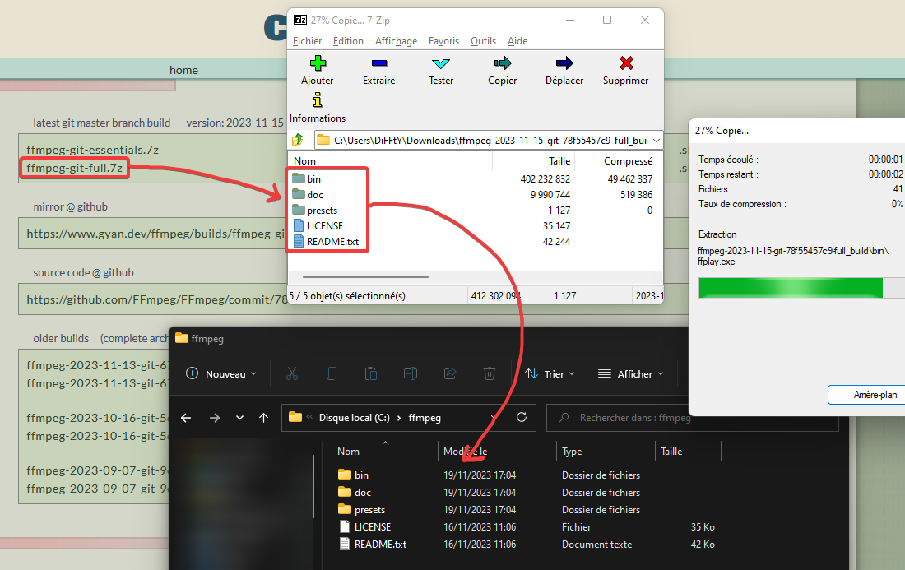
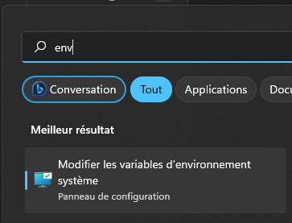
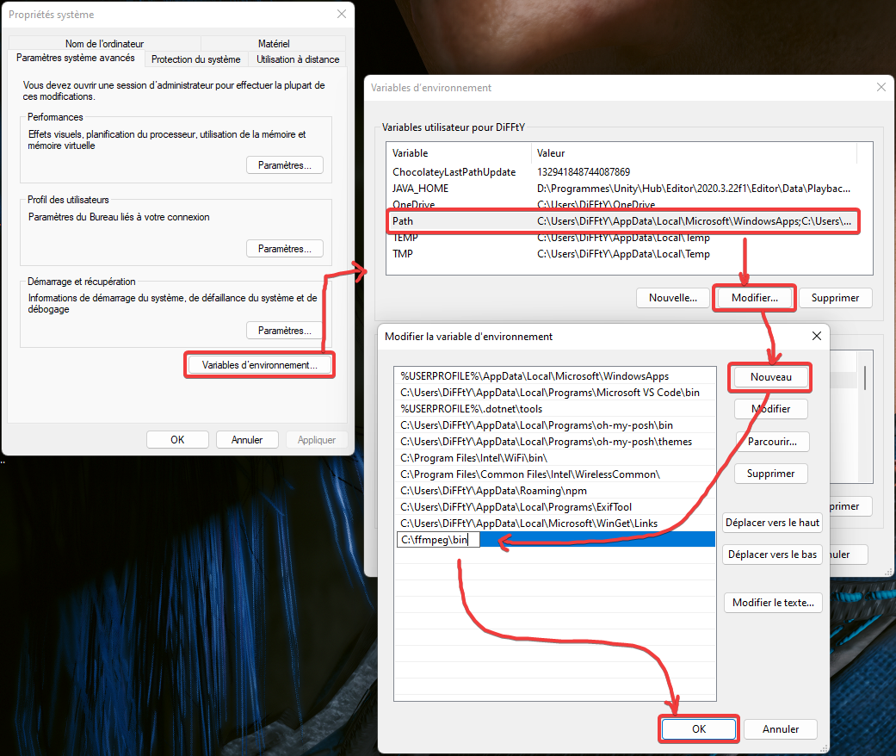
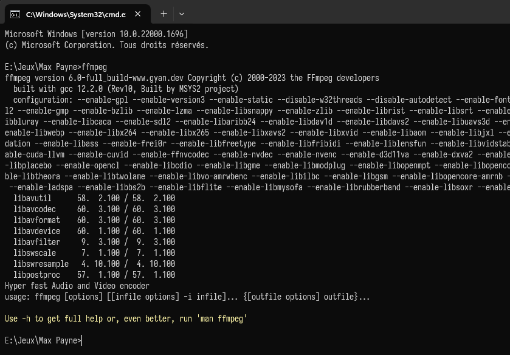
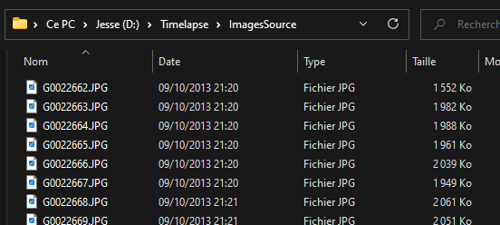
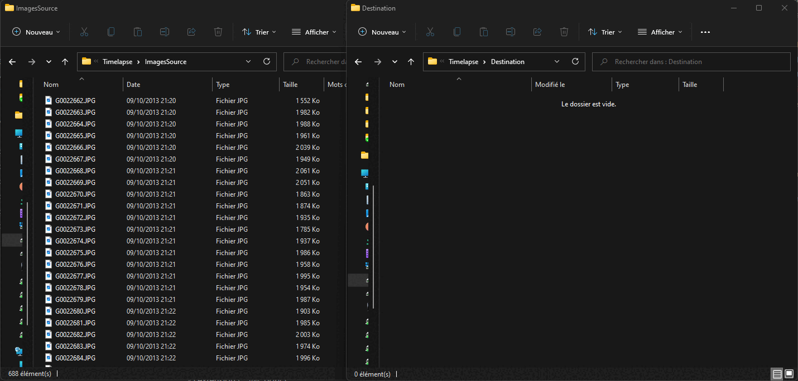

# TD 3

## Intro

On va créer un timelapse !


L'idée du script que nous allons écrire sera d'automatiser la création d'un fichier vidéo MP4 à partir de toutes les images se trouvant dans un dossier (des JPG d'un timelapse de GoPro par exemple).

Pour cela, nous mettrons toutes nos images dans un dossier, et le script les copiera et renommera afin de leur assigner un numéro de frame, avant de lancer l'outil `ffmpeg` qui se chargera d'encoder cette séquence d'image en fichier vidéo.


## Préparation : installer `ffmpeg`

Pour cela, 2 solution :

### SOLUTION 1 : Avec `winget`

Si *winget* est installé et fonctionnel sur votre machine, vous aurez juste à taper ceci dans une *Invite de commande* (Win+R > `cmd` > ENTRÉE) :

```bash
winget install ffmpeg
```

Si besoin, valider les prompts (acceptation de licence, etc) en pressant la touche `Y` puis ENTRÉE.


### SOLUTION 2 : Manuellement

* Télécharger la dernière build en récupérant le fichier `ffmpeg-git-full.7z` depuis cette page : https://www.gyan.dev/ffmpeg/builds/

* La décompresser quelque part (`C:\ffmpeg` par exemple)



* Ouvrez le menu Démarrer puis tapez `env`, avant de choisir l'option **Modifiez les Variables d'environnement**



* Ajoutez le chemin complet vers `ffmpeg.exe` (qui devrait se trouver dans le sous-dossier `bin`) à la liste de chemins de la variable d'environnement PATH



Dans les 2 cas, `ffmpeg` devrait à présent être accessible peu importe où vous vous trouverez dans votre invite de commande !




## ℹ️ Avant de commencer

Toutes les étapes décrites par la suite seront à implémenter dans votre script Python. Des astuces et points de syntaxe vous seront donnés au fur et à mesure, mais vous devrez écrire vous-même le code permettant d'implémenter ces étapes.

Un zip contenant une série d'images GoPro vous sera fourni si besoin.

Bon courage !


## 1 · Créer 2 variables pour les chemins

* l'une qui contiendra un chemin vers le dossier contenant les photos dont on veut faire le timelapse (des fichiers qui pourraient être possiblement mal numérotée, possiblement en désordre).
  *Par exemple : `D:\Timelapse\ImagesSource`.*


* l'autre contiendra le chemin cible qui contiendra les images qui seront bien réordonnées/renommées.
  *Par exemple : `D:\Timelapse\ImagesDestination`.*


## 2 · Supprimer le dossier cible (au cas où)

Si le dossier de destination des copies d'images qu'on va faire **existe déjà**, on le **supprime**.
Cela nous permettra de partir sur une base saine à chaque essaie d'exécution du script.

:::{admonition} Vérification de l'existence d'un dossier ou fichier
:class: tip, dropdown
Pour **vérifier si un chemin existe**, on peut utiliser la fonction `exists`, présente dans le module `os.path`, qu'il faudra donc importer avant !
```python
import os.path    # note: faire import os ça fonctionne aussi
dossier_existe = os.path.exists("C:/CHEMIN/A/TESTER")
```
Cette fonction retournera un booléen `True` ou `False` suivant l'existence du dossier, qu'il faudra utiliser avec une condition if afin de déterminer si l'on supprime ou non le dossier (voir ci-dessous)
:::

:::{admonition} Suppression d'un dossier
:class: tip, dropdown
Pour **supprimer un dossier et tout son contenu**, sans aucune confirmation (donc attention à ce que vous y mettez), on peut utiliser la fonction `rmtree`, du module `shutil` (qui contient de nombreuses fonctions pour manipuler des fichiers et répertoires) :

```python
import shutil
shutil.rmtree("C:/CHEMIN/A/SUPPRIMER")
```
:::


## 3 · Créer le dossier de destination

**Créer le dossier de destination** qui accueillera nos copies d'images toutes bien renommées.

:::{admonition} Création d'un dossier
:class: tip, dropdown
Pour **créer un dossier** et toute son arborescence, on peut utiliser la fonction `makedirs` du module `os` :

```python
import os
os.makedirs("C:/CHEMIN/DU/DOSSIER/A/CREER")
```
:::


## 4 · Récupérer la liste des fichiers source

Il va maintenant falloir **récupérer la liste des images** se trouvant dans notre dossier source.

:::{admonition} Listage du contenu d'un dossier
:class: tip, dropdown
Pour **récupérer le contenu d'un dossier**, on utilise la fonction `listdir`, présente dans le module `os` :

```python
import os
liste_fichiers = os.listdir("C:/CHEMIN/DU/DOSSIER/A/LISTER")
```

Cette fonction renverra une liste avec les noms des fichiers contenus dans notre dossier.

Exemple de valeur retournée par cette commande, pour un dossier contenant 6 photos : `['G0022662.JPG', 'G0022663.JPG', 'G0022664.JPG', 'G0022665.JPG', 'G0022666.JPG', 'G0022667.JPG']`
:::


## 5 · Copier et renommer les images au propre

Nous allons **copier** le contenu de notre dossier plein d'images dans le répertoire cible, en les **renommant** afin de normaliser leur nomenclature avec une numérotation par frame, commençant par la frame 1.



Au moyen d'une boucle `for` et de la liste récupérée en [(2)](#2--supprimer-le-dossier-cible-au-cas-où), il faudra, pour chacun des fichiers image présent dans le dossier, écrire un bloc de code qui exécutera les 2 actions successives suivantes :

### a) Générer un nouveau nom

Ce nom sera défini en fonction d'un compteur que l'on incrémentera de fichier en fichier, et qui ressemblera à :

* `Timelapse_001.jpg` pour le premier fichier de la liste
* `Timelapse_002.jpg` pour le deuxième, etc...

C'est-à-dire que nous allons renuméroter chacune des images avec son numéro de frame.

Pour cela, nous allons **créer une nouvelle variable**, dans laquelle nous concaténerons :
* le préfixe de notre fichier (`"Timelapse_"`)
* le numéro de frame avec padding (voir ci-dessous) (`001`, `002`...)
* l'extension (`.JPG` donc).

:::{admonition} Padding d'une chaine de caractère (aka "faire une belle numérotation")
:class: tip, dropdown
Pour obtenir le nombre avec un "**padding**" *(= signifie "remplissage" ; ici, les 0 devant le nombre qui font que l'on gardera un certain nombre de caractères en tout dans notre chaine, par exemple avec ici 3 caractères : `001`, `002`, `003`...)*.
Pour cela, on utilisera la méthode `zfill`, directement intégrée au valeurs de type chaines de caractères.
```python
str(9).zfill(3) # Ceci renverra -> 009 :)
```

Petite explication sur cette ligne :
* on convertit le nombre `9` au format chaine de caractère (*string*),
* puis on utilise la méthode `zfill` intégrée au type `string` pour ajouter le nombre de `0` devant le nombre pour que la taille de la chaine de caractères finale corresponde AU MOINS à la valeur renseignée en paramètres de `zfill`.
* cette méthode est disponible sur chaque variable de type chaîne de caractère. Par exemple : `"9".zfill(3)` c'est valide

Exemples d'utilisations de `zfill` :
```python
"12".zfill(6)    # Retournera "000012"
```
```python
"9754".zfill(3)  # Retournera "9754"
```
```python
"8".zfill(2)     # Retournera "08"
```
```python
nombre_en_string = "23"
nombre_en_string_avec_padding = nombre_en_string.zfill(5)
print(nombre_en_string_avec_padding)  # Affichera "00023"
```
:::


### b) Copie du fichier

Nous pouvons ensuite :

* Créer une nouvelle variable avec le **chemin source complet** de l'image à copier, en concaténant le chemin présent dans la variable correspondante parmi celles créées en [(1)](#1--créer-2-variables-pour-les-chemins), avec le nom du fichier correspondant à l'itération en cours de [la boucle](#5--copier-et-renommer-les-images-au-propre) que nous sommes en train d'écrire.
  
* Créer une nouvelle variable avec le **chemin de destination complet** de notre image renommée, en concaténant le chemin présent dans la variable correspondante parmi celles créées en [(1)](#1--créer-2-variables-pour-les-chemins), avec le nouveau nom de fichier que vous avez généré à l'[étape précédente](#a-générer-un-nouveau-nom).
  
* Effectuer la copie grâce à ces 2 chemins !

:::{admonition} Copie d'un fichier
:class: tip, dropdown
Pour copier un fichier, on peut utiliser `copyfile` du module `shutil`. Cette fonction prend 2 paramètres :
* le chemin **complet** vers le fichier source à copier
* le chemin **complet** vers le fichier destination (notez qu'il peut être différent ! Ainsi on fera une copie + renommage en même temps)
```python
shutil.copyfile("C:/Chemin/Fichier/Source.png", "C:/Destination.png")
```
:::

## 6 · Encodage de la vidéo

Une fois qu'on a tous nos fichiers copiés et renommés comme il faut dans un répertoire à part, on peut encoder la vidéo !

Pour cela on lancera `ffmpeg`, couteau suisse open source utilisable en ligne de commande et permettant de faire toutes les opérations imaginables sur des médias de tous types.

### a) Préparation de la ligne de commande

Nous allons donc assembler une ligne de commande, qui contiendra un appel à `ffmpeg` avec une série de paramètres choisis pour notre usage, et que nous feront exécuter automatiquement par notre script.

La commande `ffmpeg` sera la suivante :

```bash
ffmpeg -f image2 -framerate 25 -i "C:/CHEMIN/DES/IMAGES/COPIÉES/Timelapse_%04d.jpg" -c:v h264 "C:/CHEMIN/DU/TIMELAPSE/FINAL/Timelapse.mov"
```

Il faudra donc utiliser la [concaténation](./cours.md#la-concaténation) afin de construire cette commande, en insérant le chemin où se trouvent les images renommées défini en [(1)](#1--créer-2-variables-pour-les-chemins), et en précisant le chemin complet de la vidéo de sortie.

:::{note}
Dissection de cette commande ffmpeg :

* `ffmpeg`
	nom du programme à lancer (duh)
	
* `-f image2`
	format d'entrée (ici, `image2` correspond à une séquence d'image)
	
* `-framerate 25`
	framerate souhaité pour notre vidéo de sortie
	
* `-i "C:/CHEMIN/DE/LA_COPIE/Timelapse_%04d.jpg"`
	chemin vers la séquence d'images d'entrée, à transformer en vidéo
	
* `-c:v h264`
	codec de la vidéo de sortie
	
* `"C:/CHEMIN/DU/TIMELAPSE/FINAL/Timelapse.mov"`
	chemin de la vidéo de sortie qu'on va encoder
:::

:::{note}
Vous noterez l'étrange `%04d` présent dans le nom de fichier d'entrée que l'on passe à `ffmpeg`. Il s'agit de lui préciser que le fichier média d'entrée avec lequel il devra travailler est une séquence d'image, et le `%04d` précise l'endroit où se trouve le numéro de frame de chaque image, précisant au passage que ce nombre est écrit complété avec 4 zéros :) (voir la partie sur le [padding/zfill](#a-générer-un-nouveau-nom))
:::


### b) Exécution de la ligne de commande

Nous pouvons à présent exécuter la ligne de commande que nous avons construite en [(6a)](#a-préparation-de-la-ligne-de-commande), en la passant en paramètre à la fonction `os.system()`.

:::{admonition} Lancer une commande/un programme
:class: tip, dropdown
Pour lancer une commande automatiquement, on peut utiliser la fonction `system` présente dans le module `os`.

La ligne de commande sera exécutée comme si on la tapait à la main dans une Invite de Commande `cmd.exe` !

```python
os.system(la_commande_a_executer)
```
:::